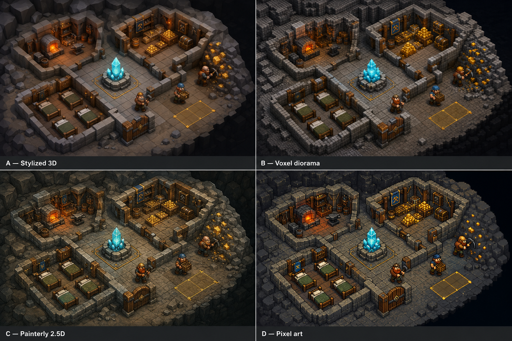

# Concept art

Return to the [project guide](../README.md). These are AI-generated concept illustrations; the design documents define gameplay, and the galleries explain each image's scope.

All project concept art is stored in this folder, grouped by subject. Keep the current concepts and their source references here. Superseded images and drafts have been removed; historical prompt records remain as provenance. Version numbers on retained filenames identify the selected revisions.

## Visual direction

[Open the style comparison](style-comparison-v1.png).

The comparison explores stylized 3D, a voxel diorama, painterly 2.5D, and pixel art. Stylized 3D was selected, with an overhead camera that supports rotation and zoom. This early comparison establishes appearance; the current room roster and functions are defined in [Rooms](../rooms.md).

## Dwarf characters

[Dwarf attraction infographic](infographics/dwarf-attraction-v1.png) shows the shared support requirements, specialist room mappings and paid Miner exception using current prototype defaults. Its [generation prompt and rule sources](infographics/prompts.md) are saved alongside it.

[View the complete dwarf gallery](dwarfs/README.md).

- [Miner](dwarfs/miner-v1.png)
- [Engineer, female workshop crafter](dwarfs/engineer-v3.png)
- [Warrior](dwarfs/warrior-v1.png)
- [Runesmith, revised combined spell researcher](dwarfs/runesmith-v2.png)

The gallery contains the current four-role roster shown above. Superseded sheets and concepts for removed or deferred roles have been removed. The [female Engineer prompt](dwarfs/prompts-v3.md), [merged-role prompts](dwarfs/prompts-v2.md), and [original prompts](dwarfs/prompts.md) are stored with the images in `dwarfs/`.

## Stonehands labor constructs

[View the Stonehands concept sheet](stonehands/README.md): the revised small, fragile mechanical worker has exposed linkages and a rune core, with front, back, overhead, mining and hauling views. The gameplay replacement is implemented; the original Miner remains available for later reuse. [Revision prompt](stonehands/prompts-v2.md).

## Cave hounds

[View the Cave Hound concept sheet](cave-hounds/README.md): a rugged dwarven companion explored for early defense and scouting, with profile, overhead, scent-tracking and protective poses. Cave Hounds are now implemented; see their gallery for current rules. [Generation prompt](cave-hounds/prompts-v1.md).

## Tunnel badgers

[View the Tunnel Badger concept sheet](tunnel-badgers/README.md): a low, sturdy animal companion explored for early defense and scouting, with powerful digging paws and a simple dwarven collar. Gameplay remains a proposal. [Generation prompt](tunnel-badgers/prompts-v1.md).

## Terrain and resources

[View the gold seam and gem column concept](terrain/README.md). This wider mining area combines one terrain layer, large square excavation cells, gold visible on top and exposed wall faces, persistent gem columns, and connected bedrock. The [revision prompt](terrain/prompts-v2.md), [original prompt](terrain/prompts.md), and user-supplied excavation reference are stored in `terrain/`.

## Levels and underground regions

[View the level and region gallery](levels/README.md). The five candidate strongholds are Border Foothold, Flooded Workings, Fallen City, Crystal Divide, and Royal Deep. Fungal Caves and Volcanic Depths have additional regional studies, covering all outlined terrain types. The approved gold-and-gem image supplies the shared terrain appearance. [Generation prompts](levels/prompts.md) are saved with the images.

## Rooms and structures

[View the room and structure gallery](rooms/README.md).

Seven room sheets each explore compact, expanded, bent or irregular, and continuous bedrock-seam layouts: [Library](rooms/library-v3.png), [Kitchen](rooms/kitchen-v3.png), [Workshop](rooms/workshop-v3.png), [Training Room](rooms/training-room-v3.png), [Treasure Room](rooms/treasure-room-v3.png), [Dormitory](rooms/dormitory-v3.png), and [Guard Post](rooms/guard-post-v3.png). Their excavated footprints follow the square grid within the approved terrain's continuous earth and bedrock banks.

[Stone Hearth](rooms/stone-hearth-v2.png) and [Bridge](rooms/bridge-v2.png) sheets each explore four terrain or placement contexts. The Hearth remains the same fixed structure in every example. All sheets and their [terrain-style revision prompts](rooms/prompts-v3.md) are stored in `rooms/`.

The [terrain reference](rooms/terrain-grid-v3.png) distinguishes connected bedrock seams from individual unmined earth tiles left inside rooms. The current [terrain and room revision prompts](rooms/prompts-v3.md) are stored with the images. Superseded sheets are available in Git history.

## Enemies

[View the complete enemy gallery](enemies/README.md).

- Upper workings: [Goblin Raider](enemies/goblin-raider-v1.png) and [Tunnel Burrower](enemies/tunnel-burrower-v1.png).
- Fungal caves: [Cave Spider](enemies/cave-spider-v1.png) and [Spore Brute](enemies/spore-brute-v1.png).
- Ancient halls: [Restless Guard](enemies/restless-guard-v1.png) and [Ancient Sentinel](enemies/ancient-sentinel-v1.png).
- Crystal caverns: [Crystal Elemental](enemies/crystal-elemental-v1.png) and [Crystalback Stalker](enemies/crystalback-stalker-v1.png).
- Volcanic depths: [Cinderling](enemies/cinderling-v1.png) and [Deepmaw](enemies/deepmaw-v1.png).

Enemy concepts and their [generation prompts](enemies/prompts.md) are stored together in `enemies/`.
