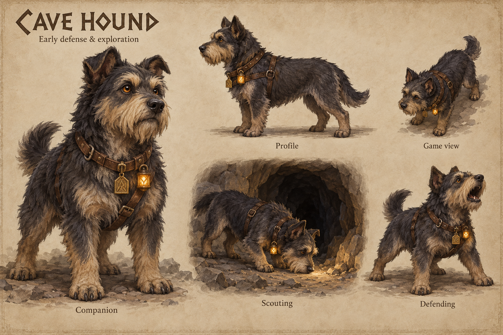

# Cave hounds

[Return to concept art](../README.md).

Visual exploration of a domesticated underground hound for early defense and exploration. The sheet explores a consistent breed in companion, profile, game-view, scouting and defending poses. A light harness and small hooded rune light suggest scouting without heavy armor.

Cave Hounds are implemented as Dormitory-supported defenders/scouts with no animal population cap; arrivals require spare reachable dens. The sheet guides their prototype model; [current character rules](../../characters.md#cave-hounds-and-population-balance) define gameplay. [Generation prompt](prompts-v1.md).
