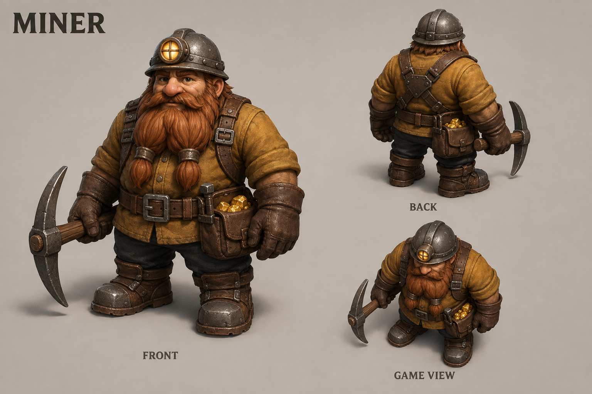
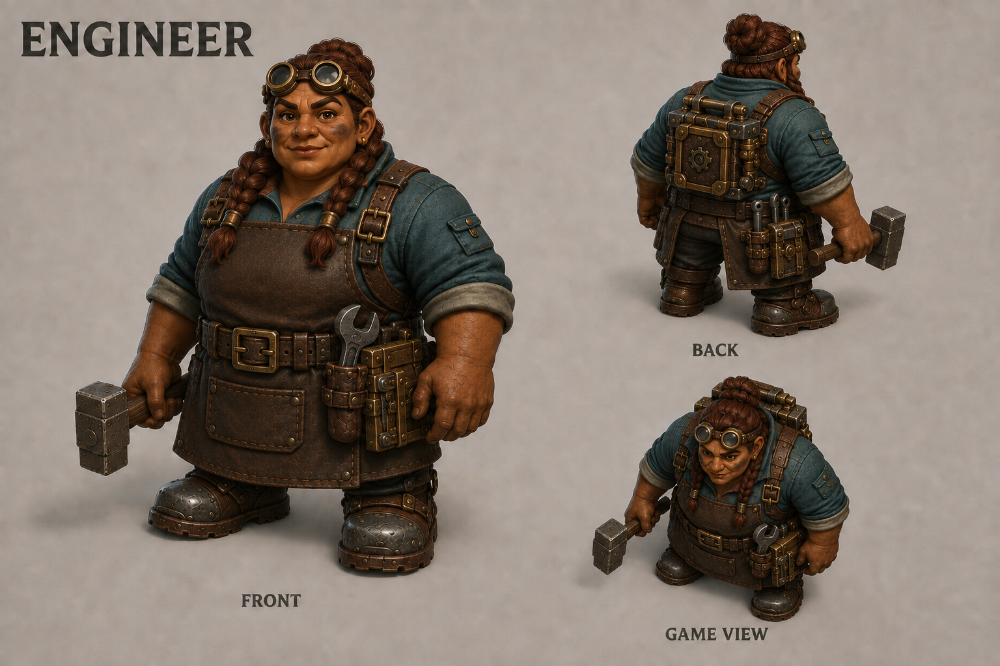
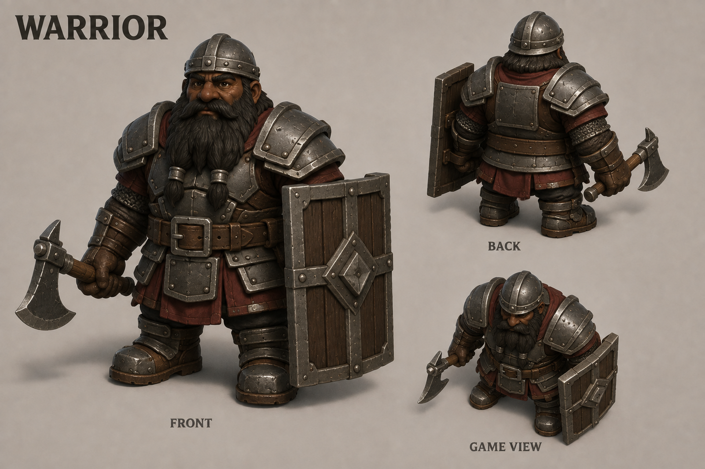
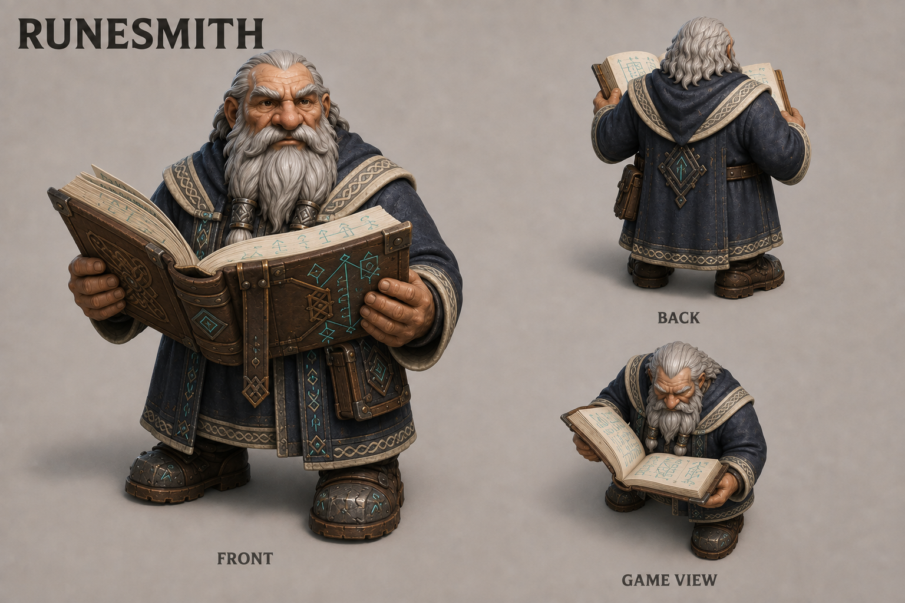

# Dwarf character concept gallery

Character concepts for the dwarven stronghold game, created with the built-in image generation tool. Each sheet contains a front three-quarter view, a rear view, and an overhead view to explore readability during play. The current set reflects the four core types: Miner, Engineer, Warrior, and Runesmith.

These are concept illustrations, not rigged 3D models or final specifications of proportions, clothing, or materials. The Engineer's female design is agreed; other appearance details remain proposals. Their appearance does not change the gameplay rules in [Characters](../../characters.md).

Return to [all concept art](../README.md).

## Current concepts

Click a character name or image to open the full PNG.

| Miner | Engineer |
|---|---|
|  |  |
| **[Miner](miner-v1.png):** ochre workwear, helmet lamp, pickaxe, and gold satchel. | **[Engineer v3](engineer-v3.png):** a sturdy female dwarf with braided hair, teal workwear, protective leather apron, goggles, hammer, and mechanism tools; one Workshop crafter making doors and traps. |

| Warrior | Runesmith |
|---|---|
|  |  |
| **[Warrior](warrior-v1.png):** heavy steel plates, crimson cloth, broad shield, and axe; attracted by the shared Training Room. | **[Runesmith v2](runesmith-v2.png):** indigo scholar's mantle, ivory ancestral trim, and an open rune book; one Library specialist researching spells. |

The Miner and Warrior appearances still fit their roles. All four dwarf types can use the Training Room, eat at Kitchens, and sleep in Dormitories. Clothing and held objects communicate identity rather than an equipment-production system.

## Art direction

- Short, broad adult dwarf proportions, large hands and boots, and readable silhouettes.
- Shared leather, cloth, stone, and forged-metal materials, with distinct role-defining equipment.
- Consistent neutral backgrounds and presentation, with front, back, and overhead studies.
- The final game assets should simplify fine surface texture and be checked at the actual camera distance. The concept views are illustrative rather than exact modeling turnarounds.

The female Engineer prompt is saved in [prompts-v3.md](prompts-v3.md). [prompts-v2.md](prompts-v2.md) records the merged-role revisions, including the current Runesmith. [prompts.md](prompts.md) preserves the original generation record, including superseded and deferred roles. Only the current four character images are retained; historical prompt records identify earlier source images that were removed.
