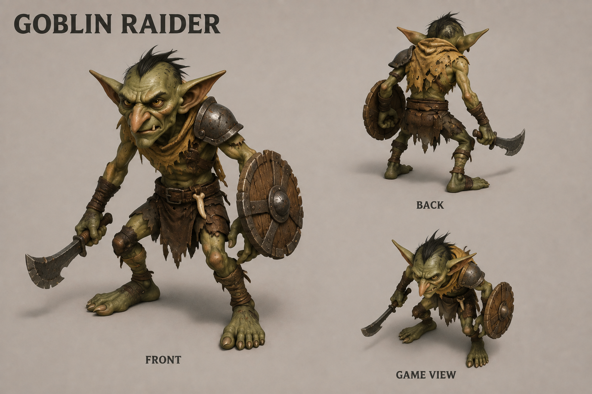
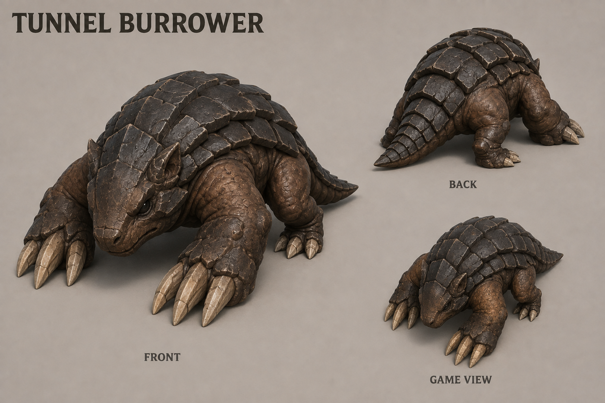
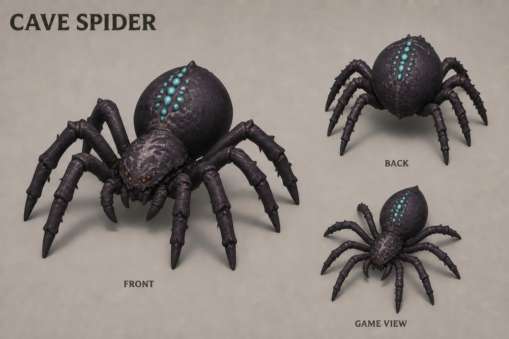
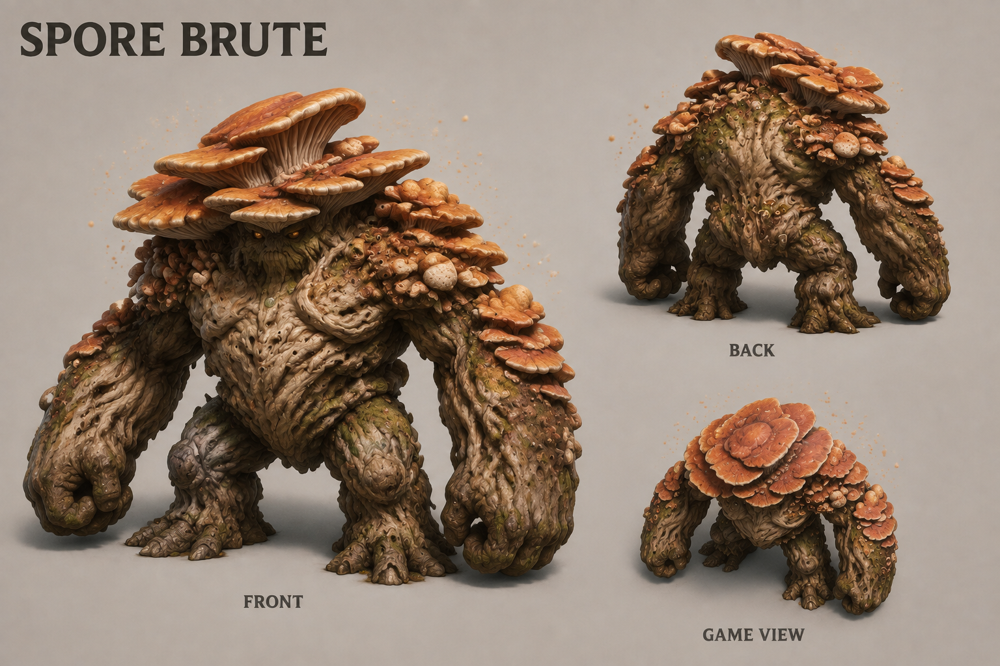
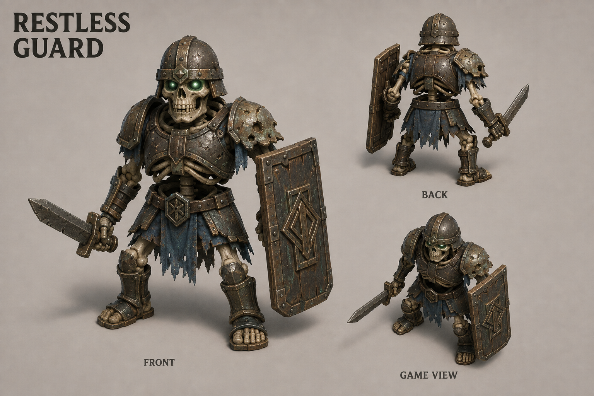
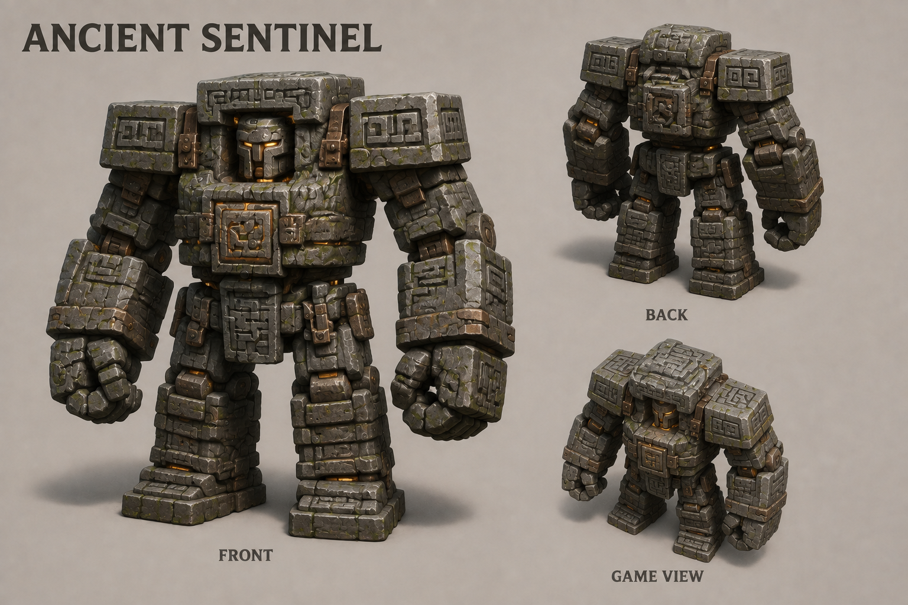
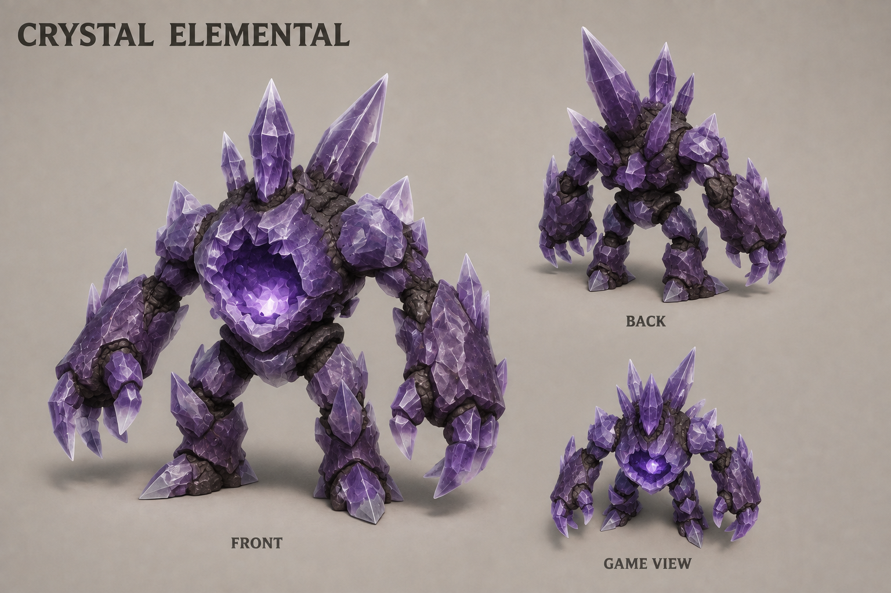
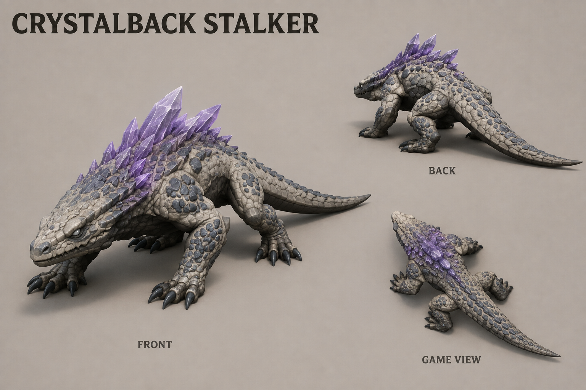
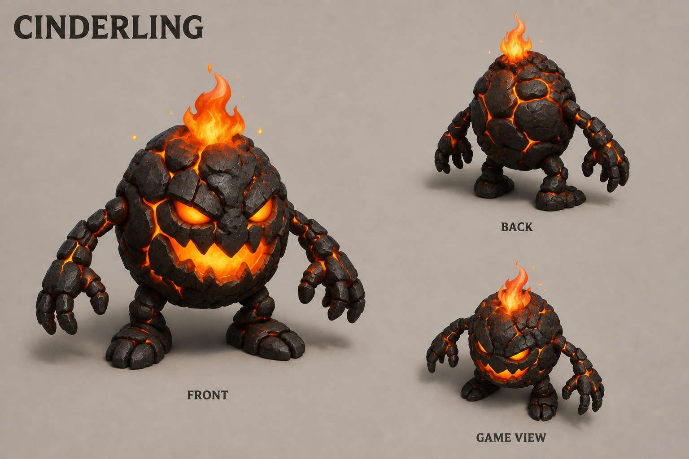
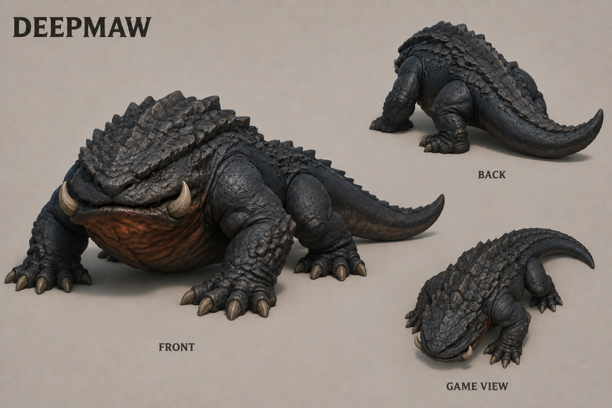

# Enemy concept gallery

Ten first-pass enemy concepts covering the five underground regions in [Levels](../../levels.md). Created with the built-in image generation tool, using the dwarf sheets' stylized 3D art direction and front, rear, and overhead presentation.

All ten enemies shown here are required by planned [M17](../../development-plan.md#m17--complete-enemy-roster-and-behavior). Only the Goblin Raider is currently implemented. These sheets are visual references, not combat specifications or rigged models. The sheets do not share a common world scale, and their views are illustrative rather than exact modeling turnarounds. Creature sizes, abilities, and encounter frequency remain design decisions.

[Return to all concept art](../README.md).

## Upper workings

| GOBLIN RAIDER | TUNNEL BURROWER |
|---|---|
|  |  |
| **[GOBLIN RAIDER](goblin-raider-v1.png)** — Long ears, scavenged armor, a hooked blade, and a scrap shield. | **[TUNNEL BURROWER](tunnel-burrower-v1.png)** — Wedge-shaped head, broad digging foreclaws, and overlapping earthen armor. |

## Fungal caves

| CAVE SPIDER | SPORE BRUTE |
|---|---|
|  |  |
| **[CAVE SPIDER](cave-spider-v1.png)** — Eight heavy angular legs, a broad abdomen, and restrained luminous markings. | **[SPORE BRUTE](spore-brute-v1.png)** — A broad mushroom cap, thick root limbs, and clustered spore growths. |

## Ancient halls

| RESTLESS GUARD | ANCIENT SENTINEL |
|---|---|
|  |  |
| **[RESTLESS GUARD](restless-guard-v1.png)** — Dwarven skeletal proportions, corroded armor, and a damaged ancient shield. | **[ANCIENT SENTINEL](ancient-sentinel-v1.png)** — A monumental slab body, carved mask, and massive stone fists. |

## Crystal caverns

| CRYSTAL ELEMENTAL | CRYSTALBACK STALKER |
|---|---|
|  |  |
| **[CRYSTAL ELEMENTAL](crystal-elemental-v1.png)** — A faceted geode body and sharply separated crystalline limbs. | **[CRYSTALBACK STALKER](crystalback-stalker-v1.png)** — A low pale reptilian body, swept crystal spines, and a long balancing tail. |

## Volcanic depths

| CINDERLING | DEEPMAW |
|---|---|
|  |  |
| **[CINDERLING](cinderling-v1.png)** — A cracked charcoal body, glowing furnace mouth, and a compact flame crest. | **[DEEPMAW](deepmaw-v1.png)** — A massive broad jaw, heavy forequarters, and a thick armored tail. |

## Design notes

- Goblins and undead provide readable armed silhouettes; other creatures have distinct animal, fungal, stone, crystal, or ember bodies.
- Color supports recognition, but equipment and body shape should distinguish threats at the normal management zoom.
- The burrower's appearance suggests excavation, but no new terrain rule is established by the artwork. Bedrock remains indestructible.
- The sentinel, elemental, and predators are candidates for heavier threats; the art does not establish bosses, new currencies, or mandatory counters.
- Fine textures should be simplified for the eventual game models and checked at actual camera distance.
- The gallery contains the current version of each enemy concept.

The complete [generation prompts](prompts.md) are saved with the images.

The incorrect initial spider draft has been removed; the gallery uses the corrected sheet.
