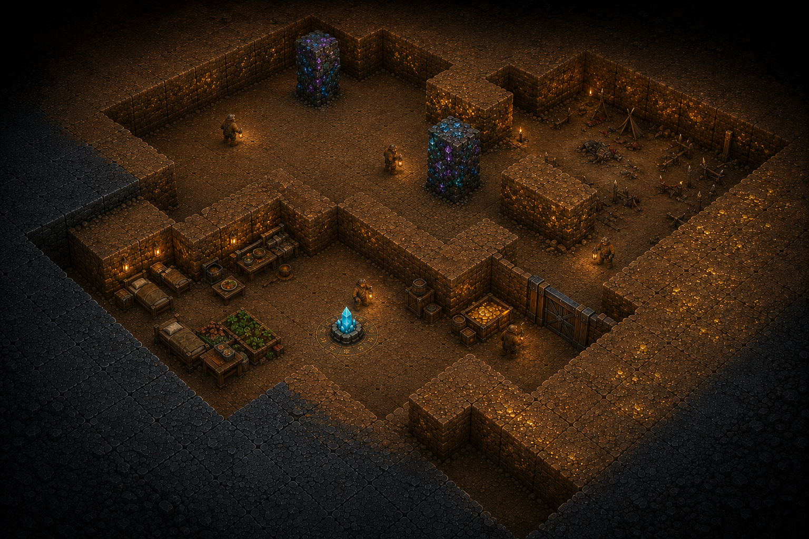
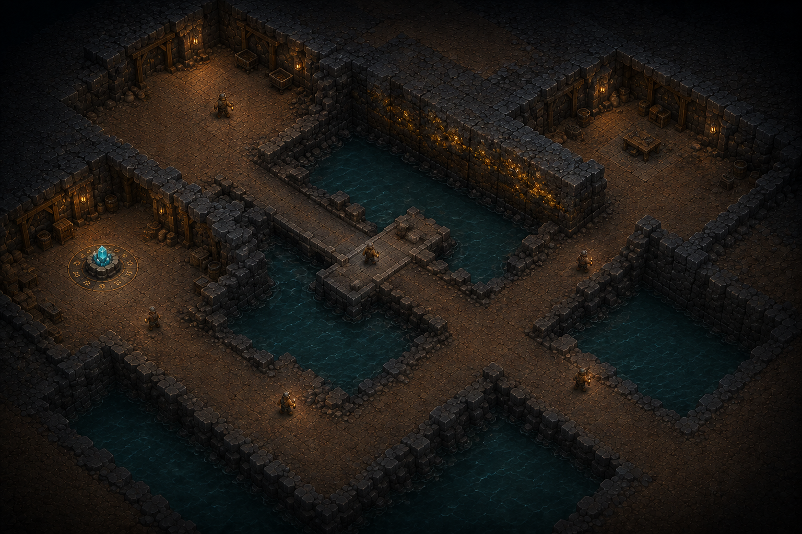
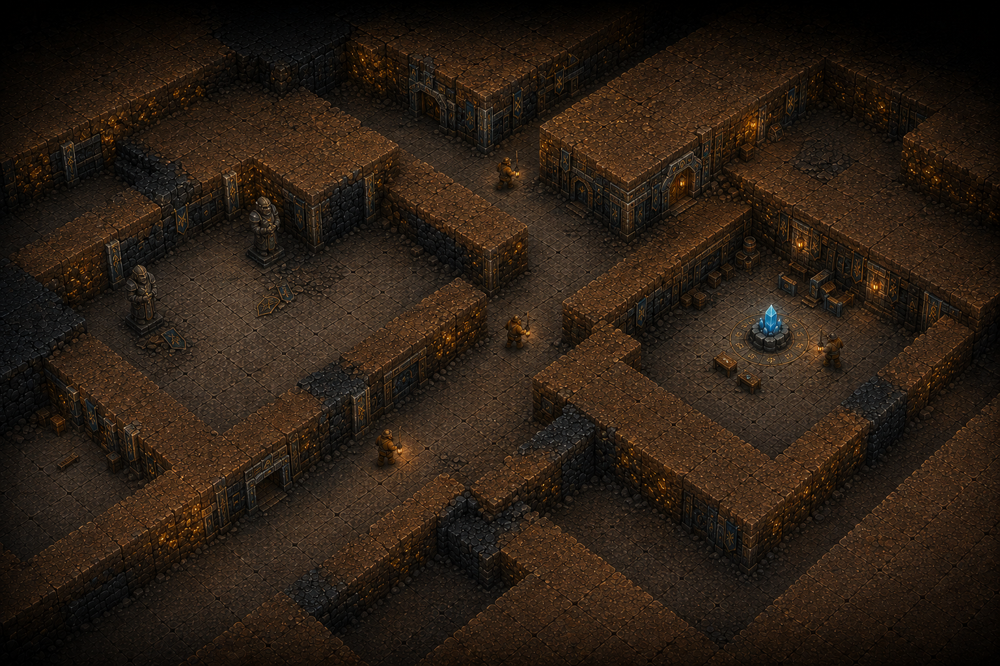
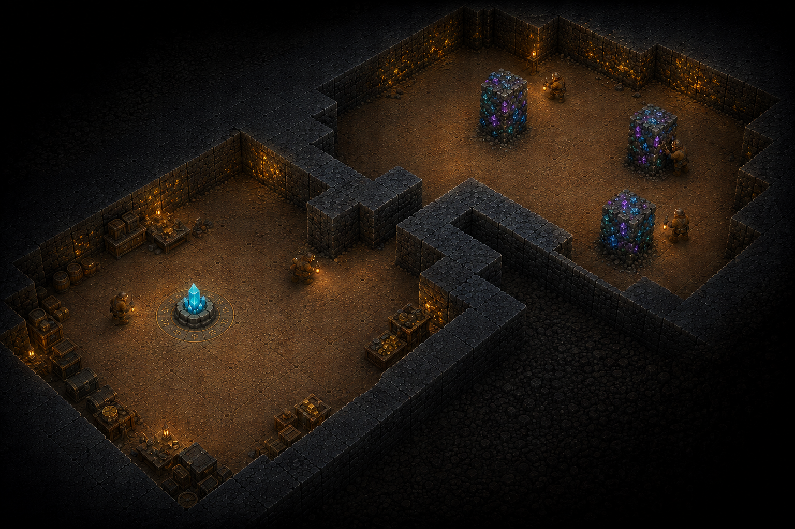
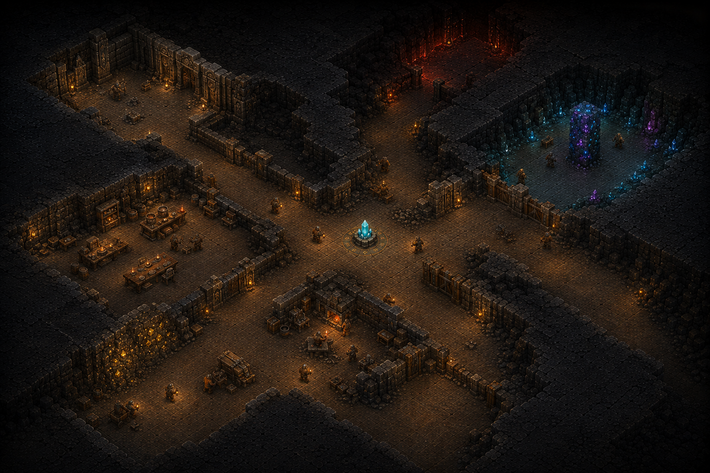
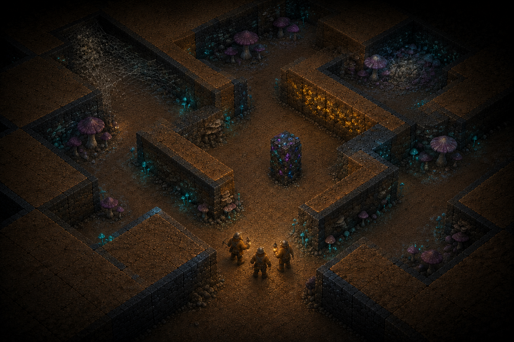
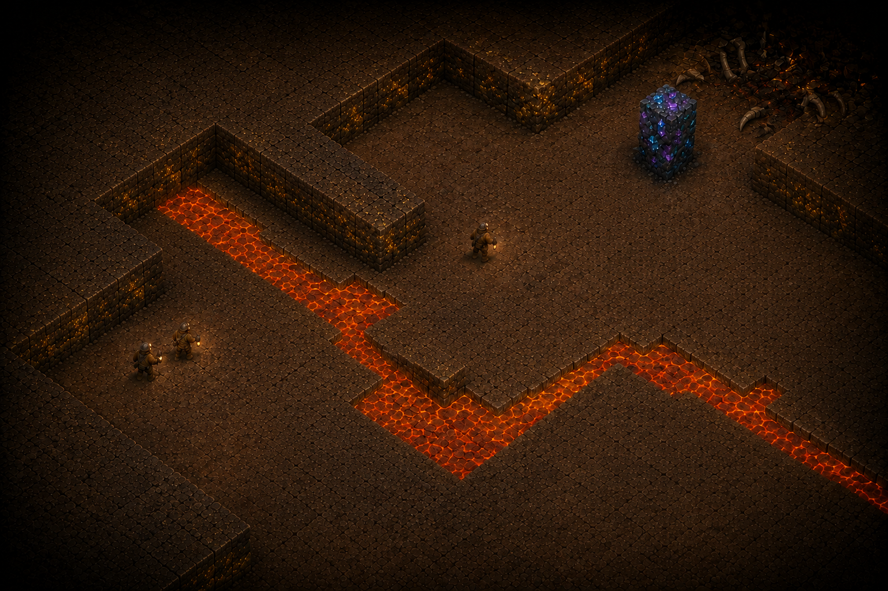

# Level and region concept gallery

Environment concepts for the dwarf stronghold game, generated with the built-in image generation tool. The user selected the [gold seam and gem column image](../terrain/resource-terrain-v2.png) as the reference for the overall terrain appearance.

Return to [all concept art](../README.md). Design: [Levels](../../levels.md), [Game rules](../../game-rules.md), and [Gameplay interface](../../gameplay-interface.md). Exact prompts and input roles are recorded in [prompts.md](prompts.md).

## Reading the set

The first five images illustrate the candidate strongholds. The final two cover the remaining terrain regions explicitly. Upper workings are represented by Border Foothold, ancient halls by Fallen City, and crystal caverns by Crystal Divide; Royal Deep brings several regions together. This covers all five candidate strongholds and all five regions already outlined without establishing extra campaign levels.

Each image depicts a representative explored area, not the entire map or a fixed room layout. The common direction is an elevated overhead view, large square terrain cells, connected bedrock, one intact terrain height, and one walkable floor plane. Water and lava are non-walkable hazards, not additional playable levels. The concept sheets contain no gameplay UI, floating text, numbers, or progress bars.

The small Stone Hearth is the same fixed core in each stronghold; larger surroundings do not upgrade it. Furnishings and creatures are illustrative and do not set capacities, production rules, final enemy abilities, or placement dimensions. Unexplored continuation remains dark; these views do not authorize revealing sealed chambers through terrain.

## Candidate strongholds

### Border Foothold

A compact starting cavern, nearby gold, a buried guard chamber, and one defensible route into the upper workings.

### Flooded Workings

Dry mining chambers divided by water and bedrock, with a short crossing and a longer hauling route.

### Fallen City

Buried halls and intersecting streets create several defensive fronts as old districts are reopened.

### Crystal Divide

Renewable gem columns sit beyond a narrow bedrock divide, making treasury access and worker defense important.

### Royal Deep

Extensive ruins and converging regional approaches leave a vulnerable core and limited safe expansion.

## Additional terrain regions

### Fungal Caves

Damp grid-based caverns, fungal growth, webs, and alternate passages provide a distinct regional environment.

### Volcanic Depths

Lava channels and continuous dark bedrock constrain dry routes to valuable deposits, without assuming lava bridges.

## Design boundaries

These are visual studies, not navigable 3D assets or tested levels. Exact geometry, visibility, furnishing clearance, routes, enemy placement, and hazard behavior require implementation and playtesting. The Flooded Workings bridge illustrates the existing water-crossing concept; the volcanic study does not establish a lava-bridge rule. The room and terrain rules in the design documents take precedence over incidental rendering details.

Only selected final images are saved here. Earlier project drafts are not reintroduced.
