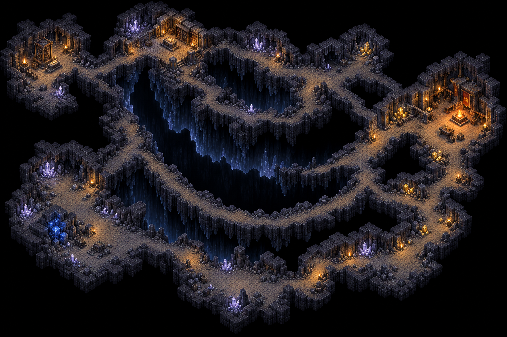
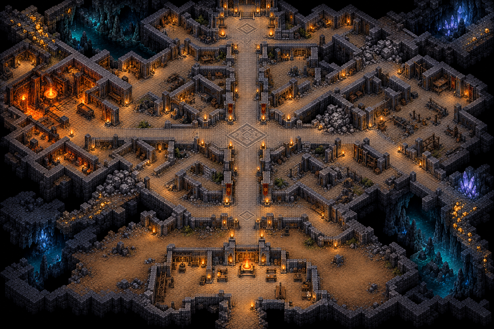
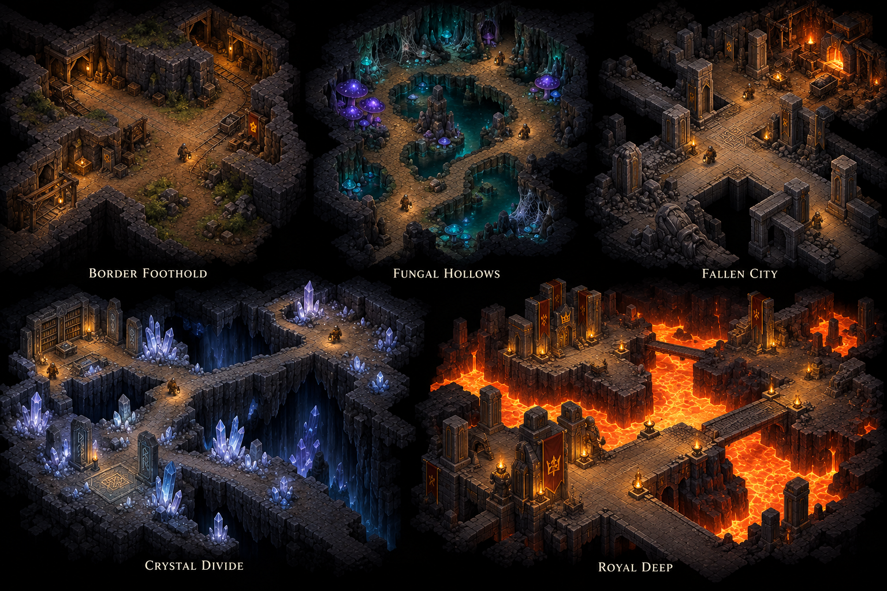
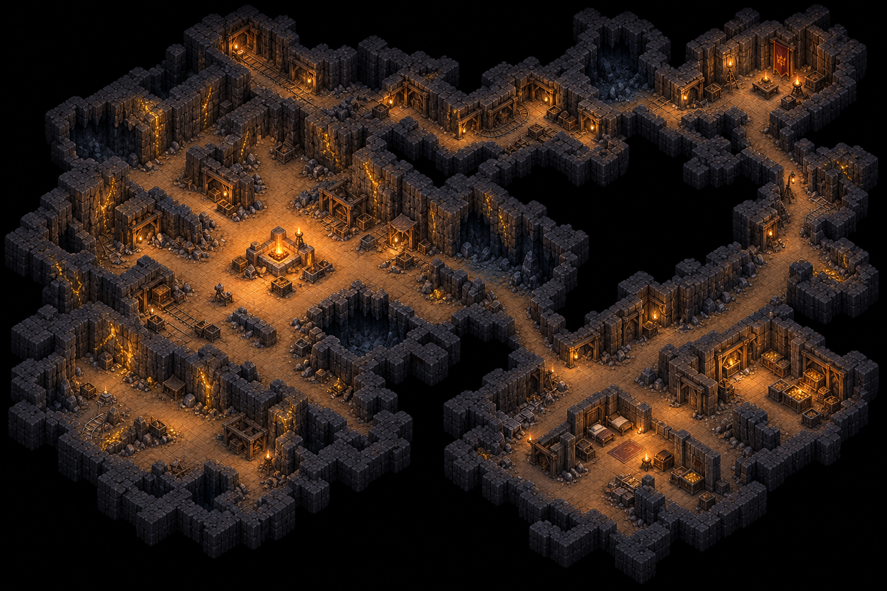
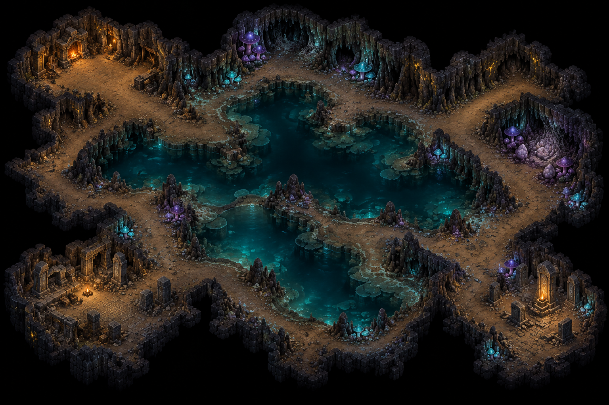

# Level overhaul concepts

## M39 — Crystal Divide

Use the long curved fracture, branching broad chambers, pale lilac edge colonies and warm archive against cold mineral ground. The single blue mineable seam is optional remote income. Ignore the image's incidental narrow spans across black space: the implemented routes go around the two ends of a crescent chasm on continuous land, with no chasm bridge or second height. The dry eastern refuge and western relay reverse the old campaign's usual starting orientation.

## M38 — Fallen City

The connected avenues, substantial civic blocks, foundry court and ruined service district establish the city. Geological breaches interrupt the grid instead of providing a standard central divider. Omit the image's incidental elevated dais, scenic crystals and molten foundry decoration: all floor stays level and this stage uses finite gold and ancient inhabitants. The pictured walls guide terrain-block composition, while reclaimable services use existing rooms and ordinary claiming.

Every M35–M42 milestone starts with newly generated concept art before implementation. These images set the feel and composition to work toward; current gameplay rules and approved excavation-scale references govern incidental details.

## M35 — Campaign direction

The shared direction is warm timber-framed workings, clustered fungal pools, coherent masonry streets, pale mineral fractures and royal lava precincts. Use their contrasting large shapes, materials and focal points. All playable surfaces remain on one plane; chasms have land routes around them, never constructed bridges. Do not copy isolated scenic spires as new terrain types or add extra floor levels from perspective details. Individual milestone concepts refine these rules before each map is rebuilt.

Generated with the built-in image tool. Exact inputs and prompts: [prompts](prompts.md). Milestones: [level overhaul](../../../level-overhaul.md).

## M36 — Border Foothold

The protected broad basin, timber throats, bent workings and separate service bay set the target. The implementation keeps diggable ground around the small initial Hearth cavern so the player creates the settlement. Illustrated rails, doors and torches are atmosphere references rather than new systems or free starting defenses. Preserve thick rock shoulders and uneven mine branches; avoid the old full-height straight divider. All floors share one plane, including the waystation and watch cavern.

The five coordinate briefs and neutral tile sketches are in [level redesign briefs](../../../research/level-redesign-briefs.md).

## M37 — Fungal Hollows

Use connected cavern lobes around substantial irregular pools, broad bare dry shores, and dense colonies confined to selected wet margins. The northwest refuge and southwest waystation contrast with the southeastern brood. The image's thin apparent water crossings are replaced by solid land around pool ends; this campaign stage has no bridges. Scenic rock spikes do not add obstacles or floor heights. The starting settlement remains player-built in excavatable ground.
