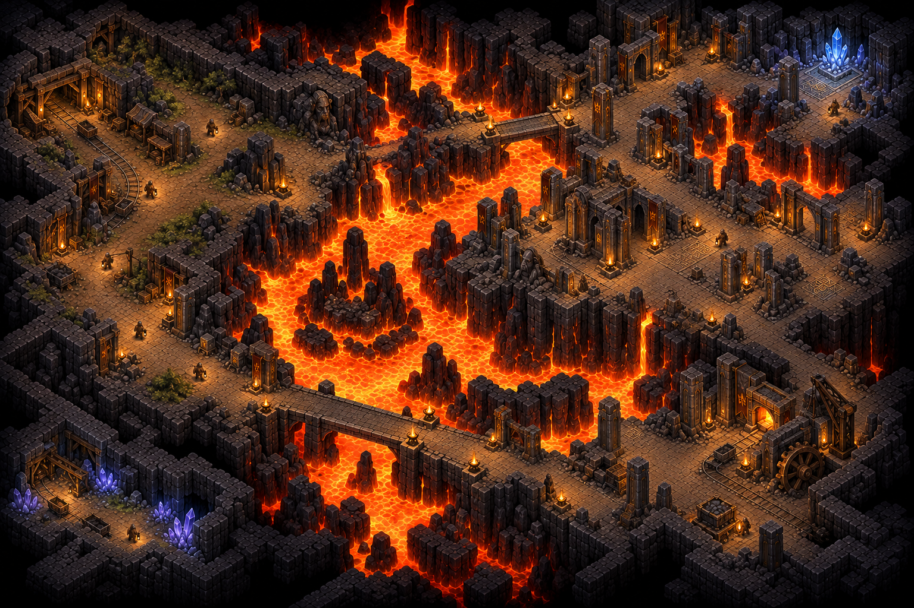
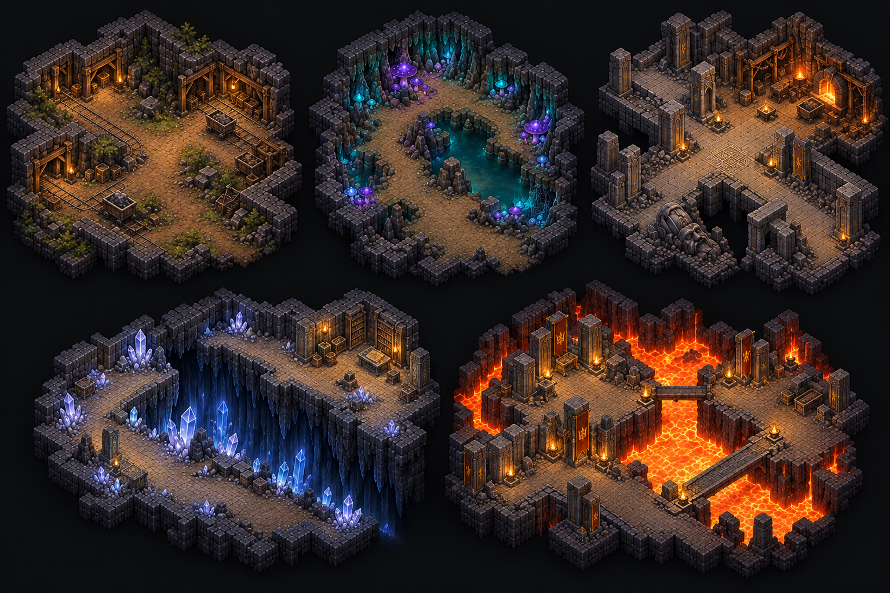

# Level overhaul concepts

Every M35–M42 milestone begins with newly generated concept art. Individual maps are authored after their own concept is inspected. Built-in image generation produced these references; exact prompts are retained below. Current rules govern incidental art details: one floor plane, one full terrain-block height, no chasm bridges, and ordinary paid construction/reclamation.

The [campaign briefs](../../../research/level-redesign-briefs.md), [standalone briefs](../../../research/standalone-redesign-briefs.md) and [level overhaul](../../../level-overhaul.md) turn the concepts into practical geography and acceptance criteria.

## M35 — Campaign direction

Warm timber workings, wet fungal colonies, coherent masonry streets, pale mineral fractures and royal lava precincts establish five contrasting places. Use their large shapes and local materials rather than incidental towers, furniture counts or floor elevations.

## M36 — Border Foothold

A protected excavatable basin, bent timber workings and a separate framed waystation guide the replacement. Illustrated rails are atmosphere references; the actual starting rooms remain player-built.

## M37 — Fungal Hollows

Connected broad lobes surround substantial irregular pools. Bare dry shelves contrast with selected wet colonies, a southwest waystation and southeastern brood. Apparent thin water crossings in the art become continuous land around pool ends; no bridges are required.

## M38 — Fallen City

Avenues, civic blocks, foundry court and service district form a buried city network interrupted by geological breaches. Omit incidental elevated dais, scenic crystals and molten workshop decoration; rooms use existing services and physical claiming.

## M39 — Crystal Divide

An eastern refuge faces a curved fracture, branching chambers, pale lilac colonies and a warm northern archive. Ignore incidental narrow spans across black space: both real routes go around chasm ends. The isolated blue income gem is optional.

## M40 — Royal Deep

A broad molten basin, royal peninsulas, short exposed bridgehead and longer foundry approach guide the final campaign map. Apparent raised courts do not change the common floor/deck plane. [Exact prompt and interpretation](m40-prompt.md).

## M41 — Campaign cohesion review

A shared excavation scale and restrained material language should hold together while each place remains recognizable from its landforms and districts. These close views guide atmosphere; the neutral whole-map comparisons separately assess geographic identity.

## M42 — Independent Free Play collection

Each composition has its own normal full-catalog start and two paid approach examples. They deliberately reuse established materials, rooms and habitats in different arrangements.

| Concept | Geographic direction |
|---|---|
| [Mining Interchange](m42-border-interchange-v1.png) | Central mine spokes, western service loop and optional southeastern galleries |
| [Emberwater Crossing](m42-emberwater-v1.png) | Three substantial banks at a cold-water and molten-stream confluence |
| [Honeycomb Quarry](m42-upper-quarry-v1.png) | Broad extraction chambers between thick rock ribs |
| [Overgrown Confluence](m42-overgrown-confluence-v1.png) | Three wet lobes and a buried civic crossing |
| [Flooded Watch Districts](m42-flooded-districts-v1.png) | Broken watch courts, a service shore and a paid causeway |
| [Prism Wells](m42-prism-wells-v1.png) | Central refuge, radial mineral chambers and an optional chasm recess |
| [Ashen Caldera](m42-ashen-caldera-v1.png) | Inward conquest of a lava-ring citadel from two outside banks |

Any incidental stairs, tall scenic spires or raised courts are excluded. Bridge decks stay level, isolated mineral scenery does not automatically provide income, and reclaimable art does not grant free starting services.

Exact prompt sets: [M35–M39 and M41](prompts.md), [M40](m40-prompt.md), [M42 upper workings](m42-upper-prompts.md), [M42 crossings and mineral caves](m42-crossing-mineral-prompts.md), [M42 wetlands](m42-wetlands-prompts.md).
