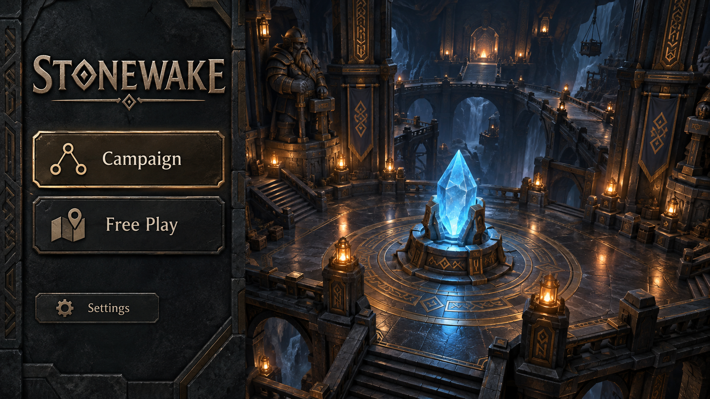
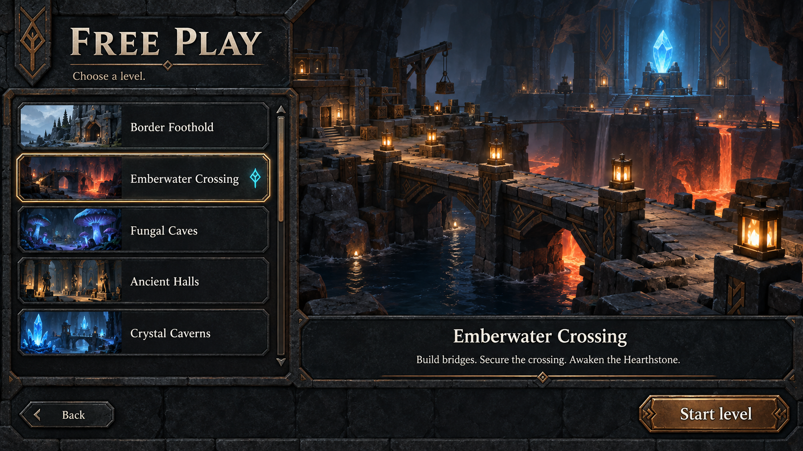

# M25 menu concepts

User-approved designs for the M25 starting menu and Free Play selector, generated with the built-in image generation tool. M25 implements these menus with real controls and prepared scenic assets. M25.1 loading screens should share this visual language. [Generation prompts](prompts-v1.md).

Return to [all concept art](../README.md). Scope: [M25 completion](../../development-history.md#m25--starting-menu-and-free-play-level-selection) and [interface rules](../../gameplay-interface.md).

## Main menu

Carved charcoal stone, bronze controls, ivory lettering, warm lantern pools and a blue Hearthstone establish the underground theme. Campaign and Free Play are the primary actions; Settings is secondary. Stonewake remains a provisional title.

## Free Play selector

A scrollable list with thumbnails supports additional levels. The selected row uses both an outline and a rune, with a larger preview, brief description and explicit Start level and Back controls. Names illustrate the catalog; they do not fix the future campaign sequence or level availability.

## Implementation interpretation

Implement these approved compositions, materials and lighting with actual accessible controls and responsive text during M25. Prepare matching background assets and interactive UI layers; preserve the approved designs. The scenic backgrounds are illustrative: elevated halls, stairs, waterfalls and the outdoor thumbnail do not change the single-layer underground gameplay or prescribe real map geometry. In-game hidden objectives still obey fog; menu illustrations are not live map previews. M33 owns the gameplay lighting implementation. Asset/settings details remain provisional.
