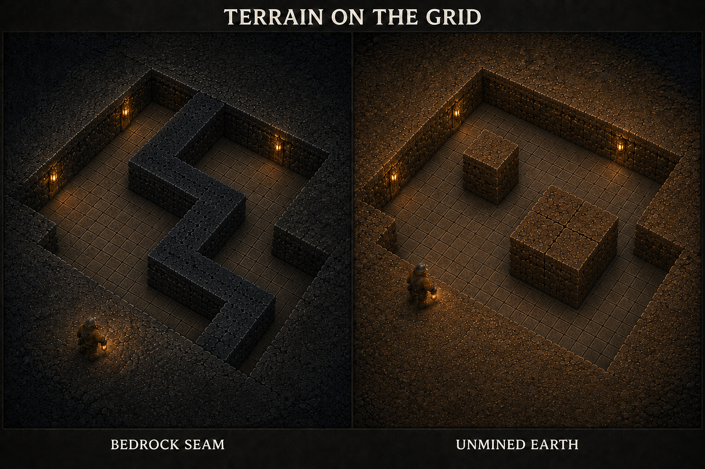
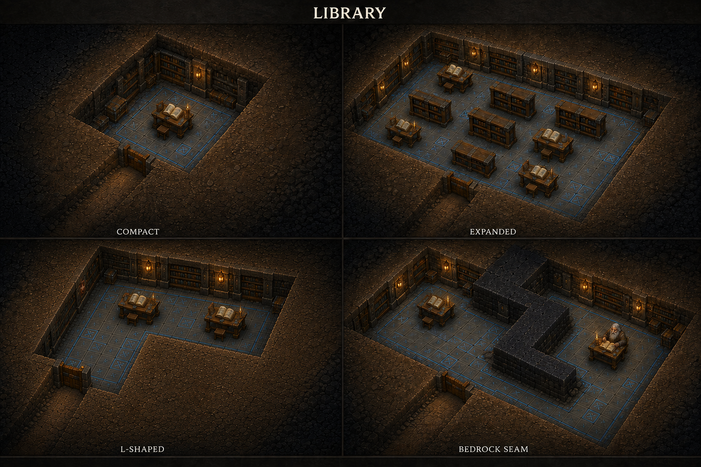
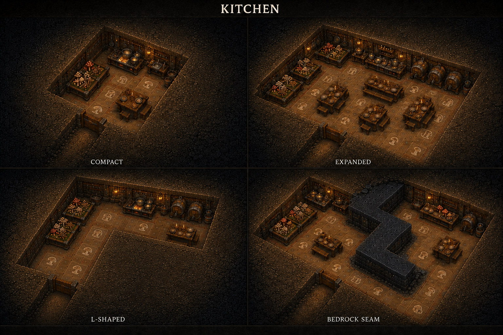
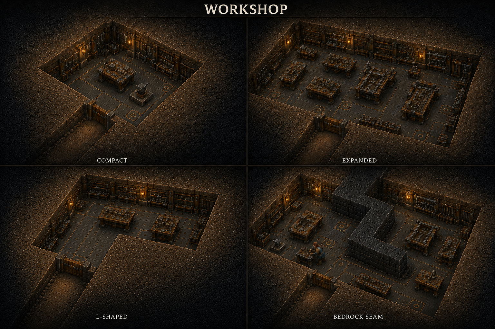
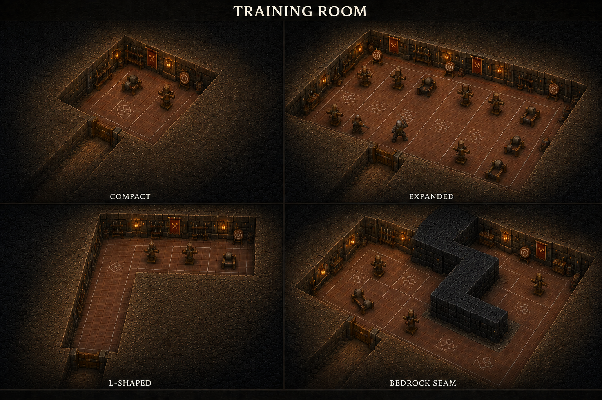
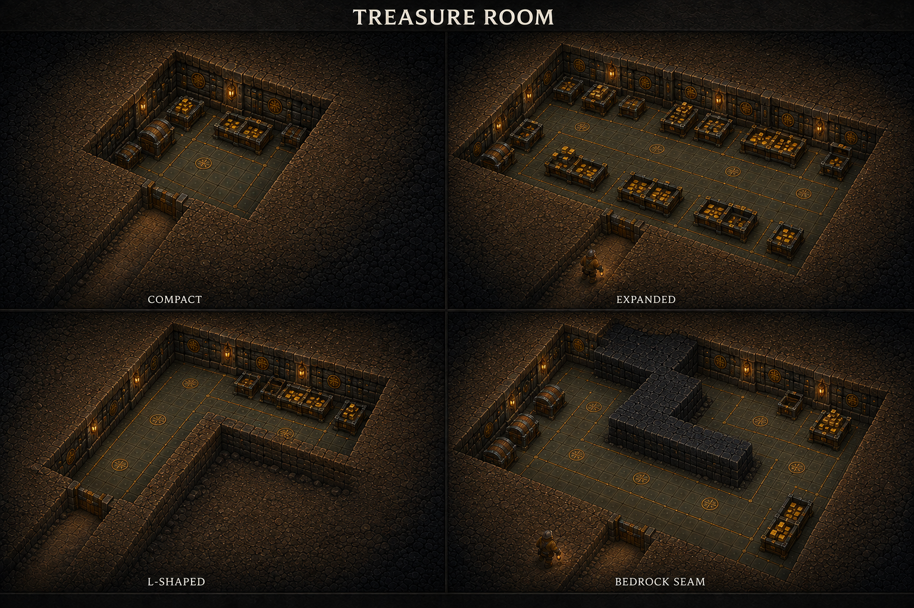
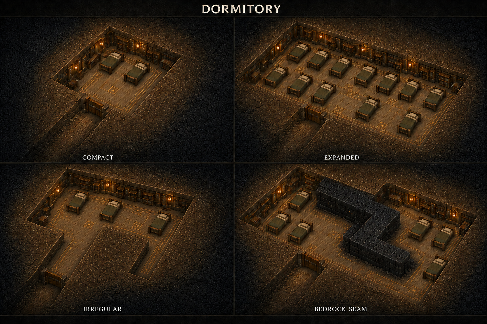
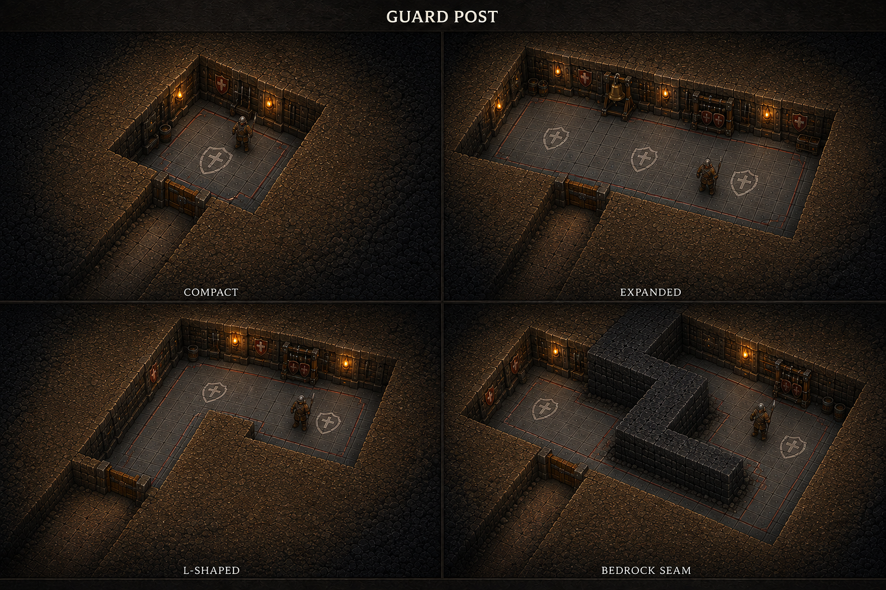
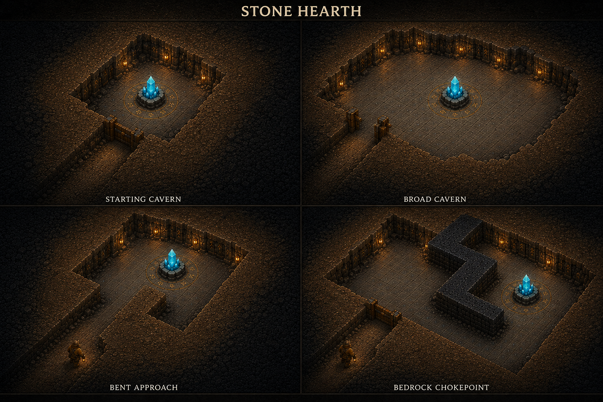
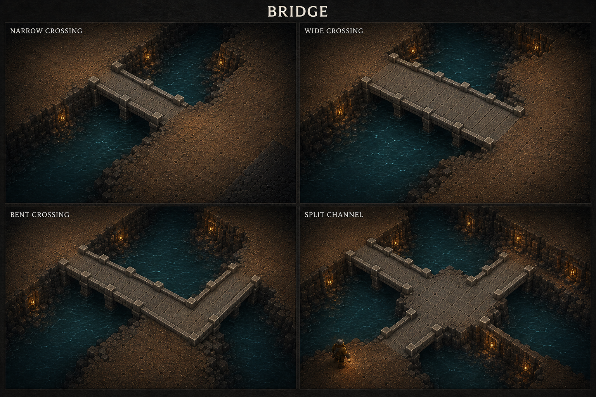

# Room and structure concept gallery

Concept art for the current dwarf stronghold design, generated with the built-in image generation tool. Room and structure sheets use stylized 3D and an overhead view, with four layout studies each. A companion terrain reference distinguishes bedrock seams from unmined earth. All sheets now follow the user-approved [overall terrain style](../terrain/resource-terrain-v2.png).

Return to [all concept art](../README.md). Gameplay details: [Rooms](../../rooms.md), [Characters](../../characters.md), [Levels](../../levels.md), and [Game rules](../../game-rules.md).

## Current room references

The [six sparse room concepts and exact prompts](overhaul/prompts.md) supersede the earlier floor/furnishing arrangements shown below. [Room presentation](../../room-overhaul.md) owns the current adaptive models, real gold piles and resident-assigned bedding. Earlier sheets remain useful terrain/footprint studies; Guard Post is deferred.

## How to read the room sheets

The seven earlier room sheets each show **compact**, **expanded**, **L-shaped or irregular**, and **bedrock seam** examples. All four examples are excavations within continuous earth and bedrock, using the approved terrain's dense weathered materials, warm lantern light, and overhead presentation. Their fourth panels show bedrock connected to surrounding geology, with exposed boundaries following whole square tiles and right-angle turns. Intact terrain shares one height above a common floor plane. Distinctive floors and existing wall treatments retain each room's identity; furniture fits the remaining usable space.

These are visual layout studies, not fixed room templates, minimum sizes, furniture counts, or upgrade stages. Other tile-based shapes remain valid. Implemented capacity comes from floor area; cosmetic furnishings do not block navigation or services. Access passages and composition expose the designs without introducing another playable floor. Sheet titles and margin captions are concept-sheet labels, not part of the gameplay interface.

Click any image or title to open the full sheet.

## Terrain on the grid

**[Terrain reference](terrain-grid-v3.png):** bedrock usually continues as a seam or band through the surrounding geology. An isolated square or small group left inside a room can instead be ordinary unmined earth, which remains diggable. Both occupy whole terrain cells, exclude room floor and furniture, and constrain movement. Natural rock and soil surface detail must preserve the grid-shaped blocking footprint.

## Work, research, and food

| Library | Kitchen |
|---|---|
|  |  |
| **[Library](library-v3.png):** compact shelves and lecterns grow into research tables and shelf rows with aisles. Blue floor inlays and book-lined wall faces establish identity. | **[Kitchen](kitchen-v3.png):** shared mushroom growing, food preparation, brewing, and dining expand together. One large room or several accessible rooms can support the population. |

| Workshop | Training Room |
|---|---|
|  |  |
| **[Workshop](workshop-v3.png):** compact benches and anvils expand into door and trap assembly areas. Tool boards and brass floor markings identify the combined craft facility. | **[Training Room](training-room-v3.png):** practice stations, targets, and exercise space fit around clear routes. Engineers, Warriors and Runesmiths can train here; sleeping remains in Dormitories. |

## Storage and accommodation

| Treasure Room | Dormitory |
|---|---|
|  |  |
| **[Treasure Room](treasure-room-v3.png):** chests and storage bays repeat as space grows, with access for hauling and payday. Illustrated gold is sample inventory, not automatic wealth from building the room. | **[Dormitory](dormitory-v3.png):** consistent bed sizes, shared accommodation, and reachable sleeping positions in small, broad, bent, and seam-constrained footprints. |

## Guard Post

**[Guard Post](guard-post-v3.png):** shield-marked floor identifies usable guarding space even with few furnishings. Wider or irregular areas add standing space and optional signal or storage fittings while keeping routes open. This room uses existing defenders and does not introduce another dwarf type.

## Supporting structures

| Stone Hearth | Bridge |
|---|---|
|  |  |
| **[Stone Hearth](stone-hearth-v2.png):** the same fixed core in a starting cavern, broad cavern, bent approach, and bedrock chokepoint. The surrounding layout changes; the core has no upgrades. | **[Bridge](bridge-v2.png):** narrow, wide, bent, and split-channel crossing concepts using connected deck tiles. Routing and crossing permissions remain proposals; these water examples do not establish lava behavior. |

## Scope and provenance

The sheets cover the current room and structure catalog. They add no dwarf classes, specialist-only quarters, or separate food-processing facilities. Normal residents are Stonehands, Cave Hounds, Engineers, Warriors and Runesmiths; the Miner is retained for debug. The Engineer's current character design is female.

These are environment concepts, not modular 3D assets or tested navigation layouts. Exact current prompts and reference usage are saved in [prompts-v3.md](prompts-v3.md). The earlier [grid correction prompts](prompts-v2.md) and [original prompts](prompts.md) preserve generation history.

Earlier-than-v3 sheets have been removed from the working gallery; the retained v3 studies are superseded for furnishings by the sparse concepts above. The previous set is available in Git history at commit `26bf924`; filenames in historical prompts identify the actual inputs used. The gallery contains nine current room/structure sheets and the updated terrain-grid study.
