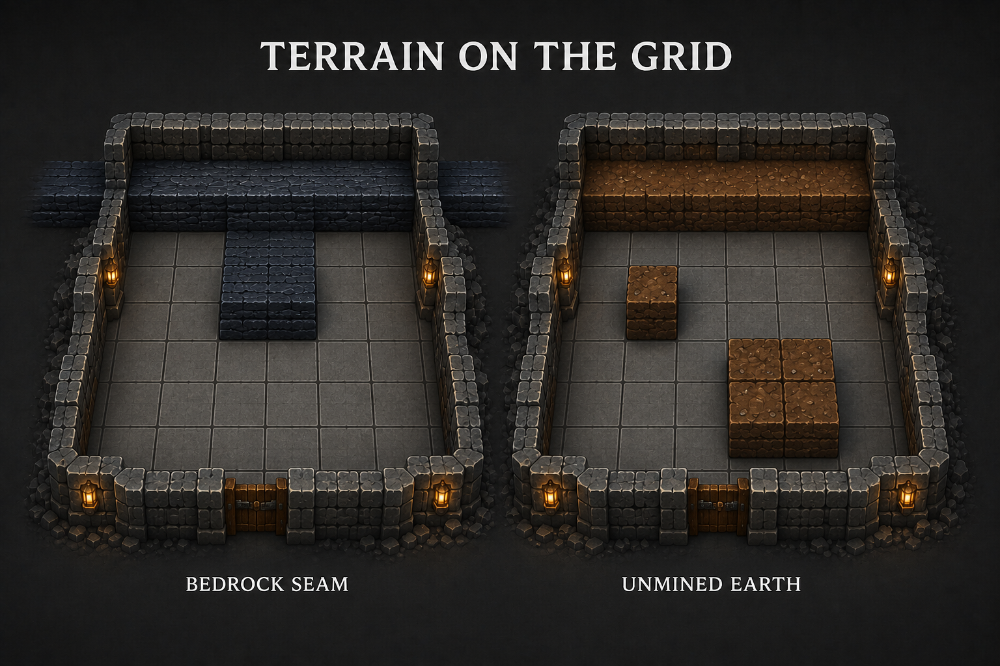
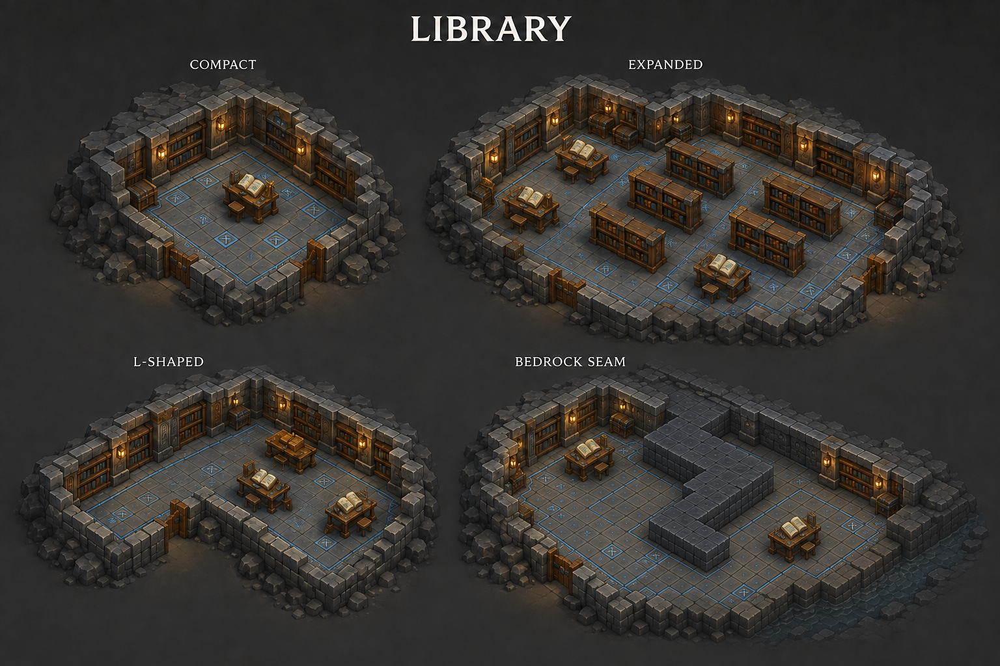
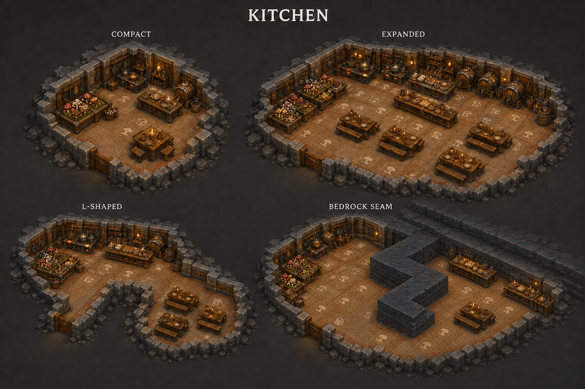
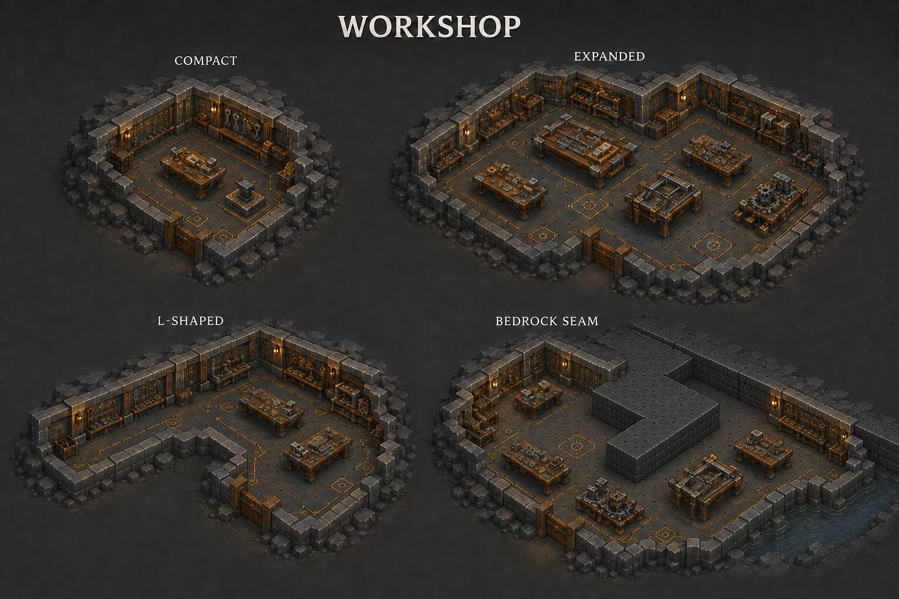
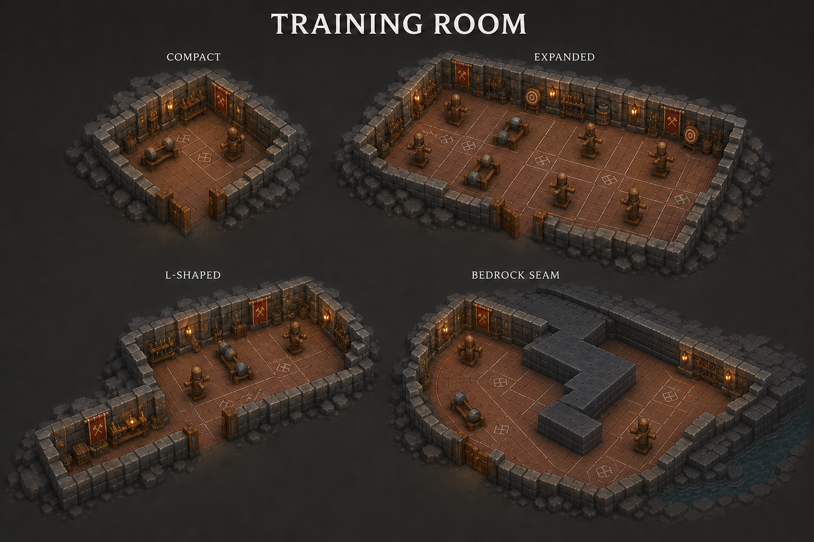
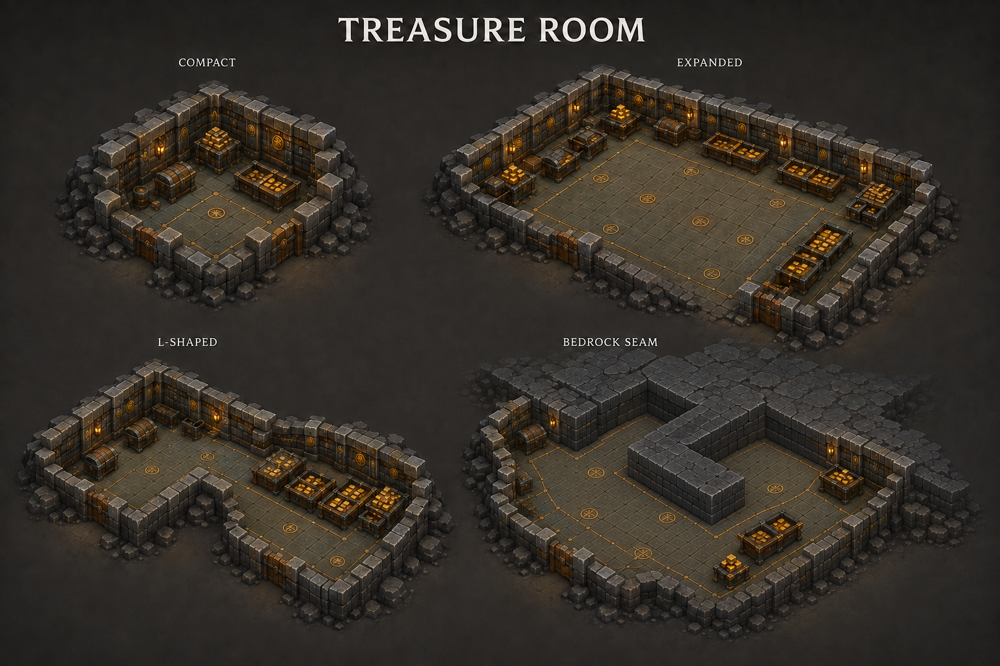
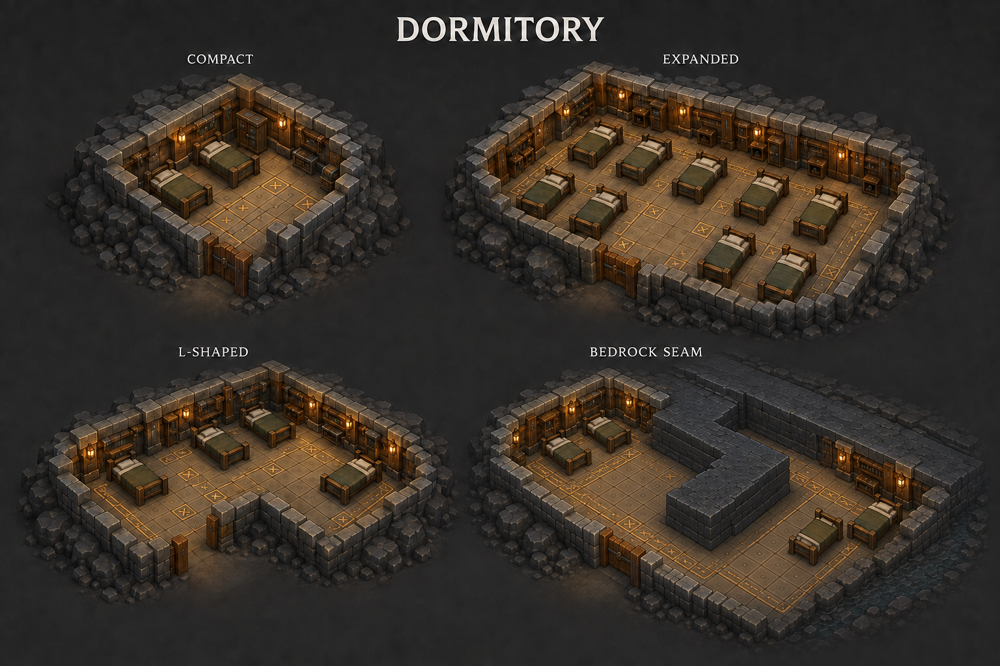
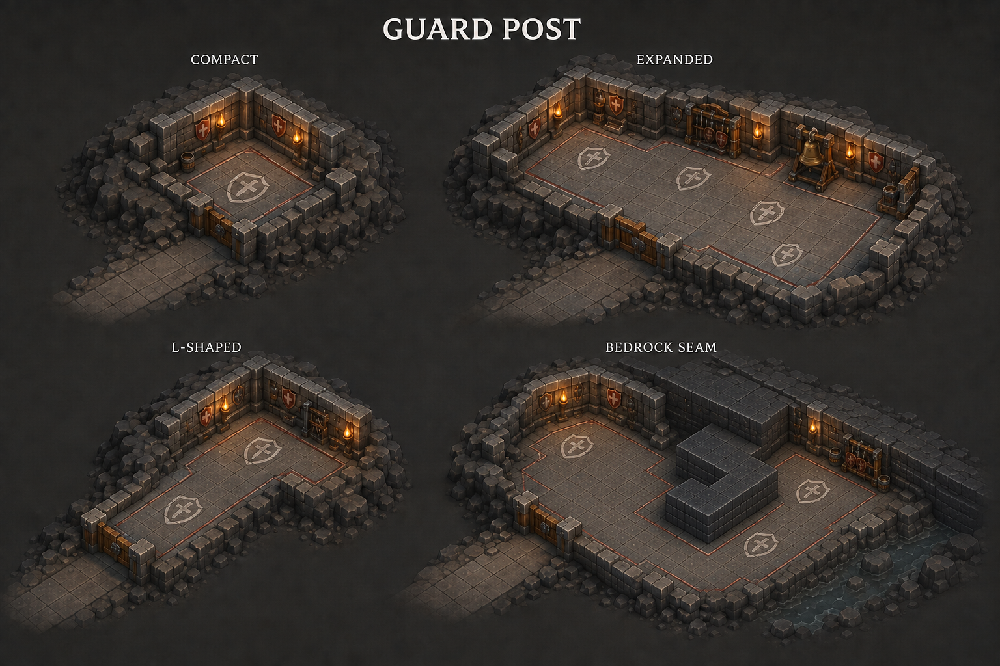
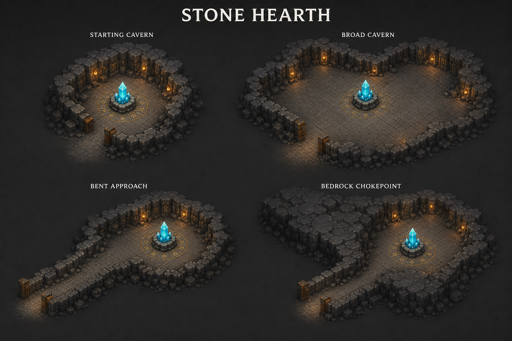
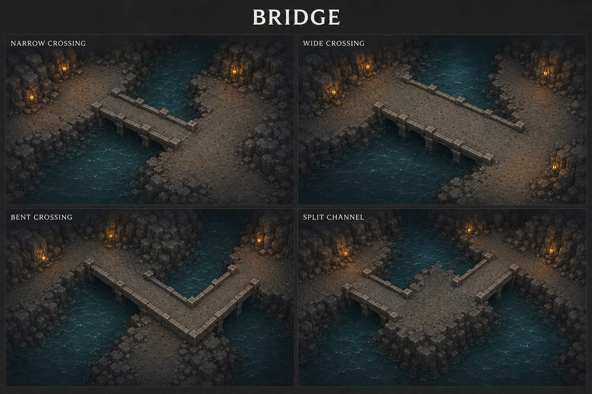

# Room and structure concept gallery

Concept art for the current dwarf stronghold design, generated with the built-in image generation tool. Room and structure sheets use stylized 3D and an overhead view, with four layout studies each. A separate terrain reference distinguishes bedrock seams from unmined earth.

Return to [all concept art](../README.md). Gameplay details: [Rooms](../../rooms.md), [Characters](../../characters.md), [Levels](../../levels.md), and [Game rules](../../game-rules.md).

## How to read the room sheets

The seven expandable rooms each show **compact**, **expanded**, **L-shaped**, and **bedrock seam** examples. Their revised fourth panels show continuous bedrock connected to the surrounding terrain, with exposed boundaries following whole square tiles and right-angle steps. Floors and existing wall treatments retain the room's identity; furniture fits the remaining usable space.

These are visual layout studies, not fixed room templates, minimum sizes, furniture counts, or upgrade stages. Other tile-based shapes remain valid. Functional footprints, navigation clearance, and capacity calculations still need prototyping. Foreground walls are cut away to expose the designs; this presentation does not establish new wall or visibility rules.

Click any image or title to open the full sheet.

## Terrain on the grid

**[Terrain reference](terrain-grid-v2.png):** bedrock usually continues as a seam or band through the surrounding geology. An isolated square or small group left inside a room can instead be ordinary unmined earth, which remains diggable. Both occupy whole terrain cells, exclude room floor and furniture, and constrain movement. Natural rock and soil surface detail must preserve the grid-shaped blocking footprint.

## Work, research, and food

| Library | Kitchen |
|---|---|
|  |  |
| **[Library](library-v2.png):** compact shelves and lecterns grow into research tables and shelf rows with aisles. Blue floor inlays and book-lined wall faces establish identity. | **[Kitchen](kitchen-v2.png):** shared mushroom growing, food preparation, brewing, and dining expand together. One large room or several accessible rooms can support the population. |

| Workshop | Training Room |
|---|---|
|  |  |
| **[Workshop](workshop-v2.png):** compact benches and anvils expand into door and trap assembly areas. Tool boards and brass floor markings identify the combined craft facility. | **[Training Room](training-room-v2.png):** practice stations, targets, and exercise space fit around clear routes. Every current dwarf type can train here; sleeping remains in Dormitories. |

## Storage and accommodation

| Treasure Room | Dormitory |
|---|---|
|  |  |
| **[Treasure Room](treasure-room-v2.png):** chests and storage bays repeat as space grows, with access for hauling and payday. Illustrated gold is sample inventory, not automatic wealth from building the room. | **[Dormitory](dormitory-v2.png):** consistent bed sizes, shared accommodation, and reachable sleeping positions in small, broad, bent, and seam-constrained footprints. |

## Guard Post

**[Guard Post](guard-post-v2.png):** shield-marked floor identifies usable guarding space even with few furnishings. Wider or irregular areas add standing space and optional signal or storage fittings while keeping routes open. This room uses existing defenders and does not introduce another dwarf type.

## Supporting structures

| Stone Hearth | Bridge |
|---|---|
|  |  |
| **[Stone Hearth](stone-hearth-v1.png):** the same fixed core in a starting cavern, broad cavern, bent approach, and bedrock chokepoint. The surrounding layout changes; the core has no upgrades. | **[Bridge](bridge-v1.png):** narrow, wide, bent, and split-channel crossing concepts using connected deck tiles. Routing and crossing permissions remain proposals; these water examples do not establish lava behavior. |

## Scope and provenance

The sheets cover the current room and structure catalog. They add no dwarf classes, specialist-only quarters, or separate food-processing facilities. The four resident types are Miner, Engineer, Warrior, and Runesmith; the Engineer's current character design is female.

These are environment concepts, not modular 3D assets or tested navigation layouts. Exact correction prompts and reference usage are saved in [prompts-v2.md](prompts-v2.md); [prompts.md](prompts.md) preserves the original generation record, including the current Stone Hearth and Bridge sheets.

Superseded room sheets and the initial terrain-grid study have been removed. The gallery contains the current layouts; their prompt records preserve the revision history.
