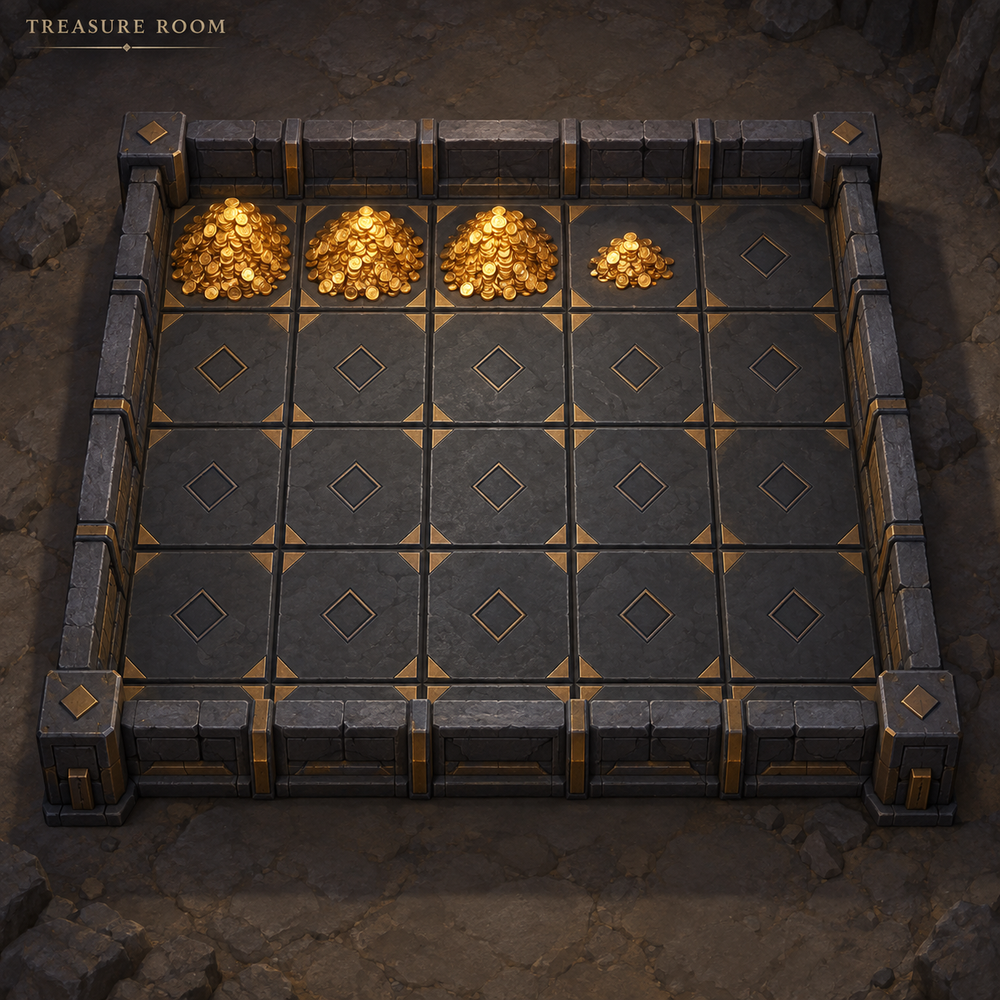
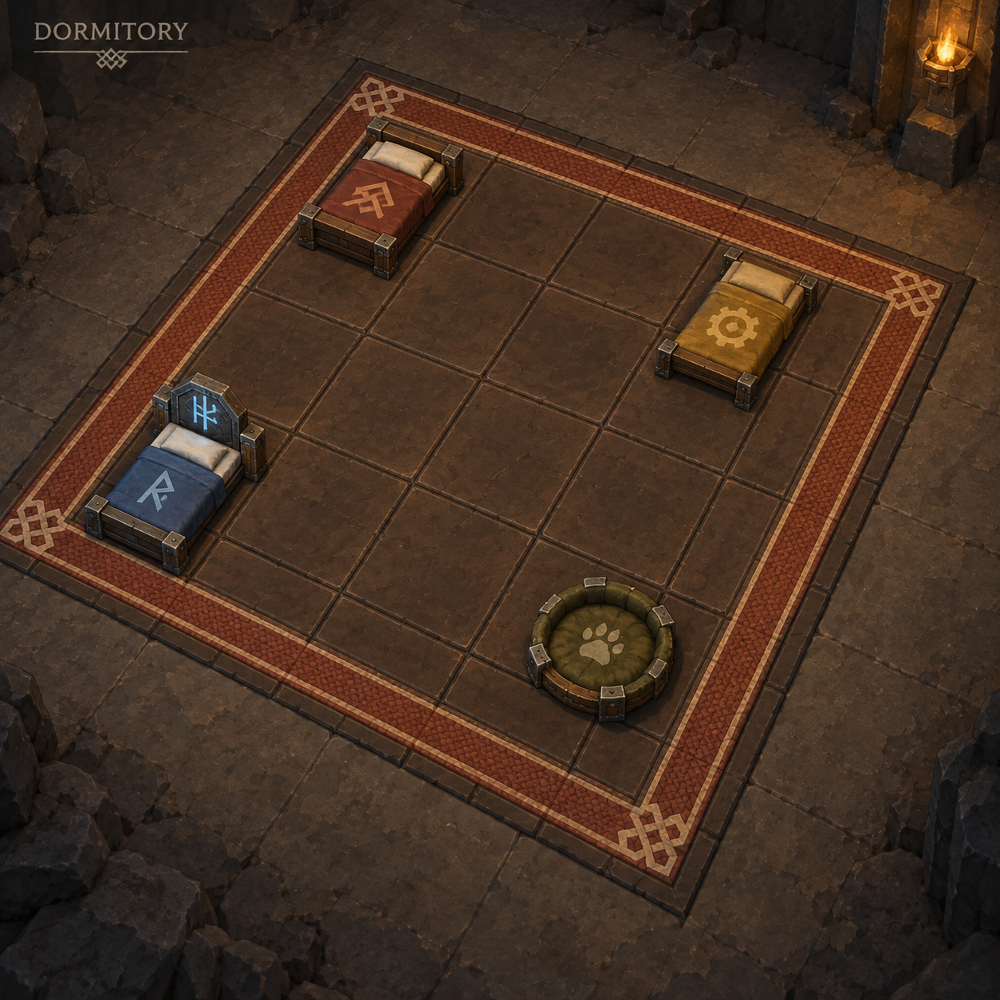
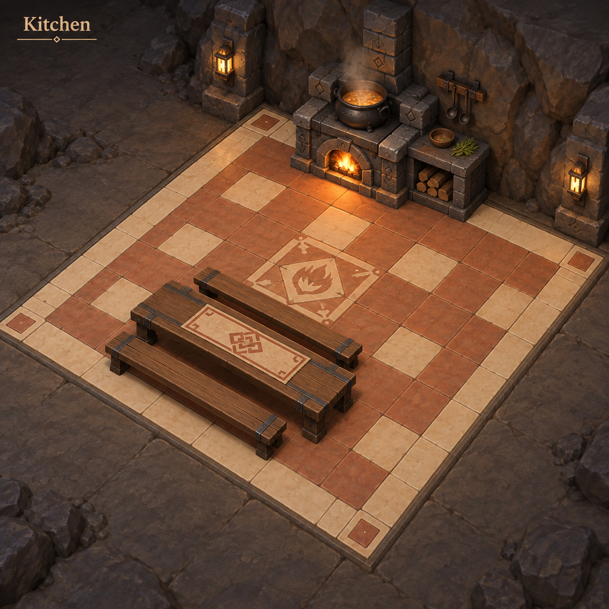
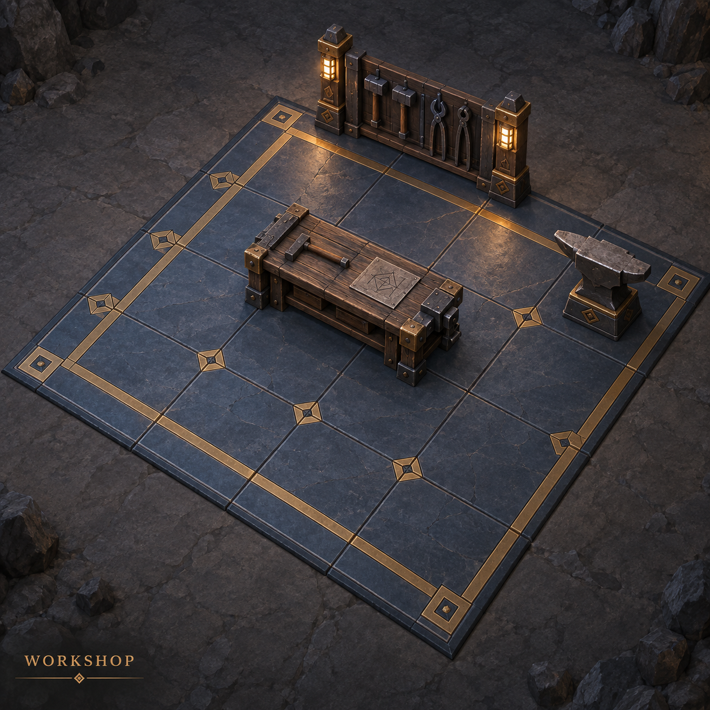
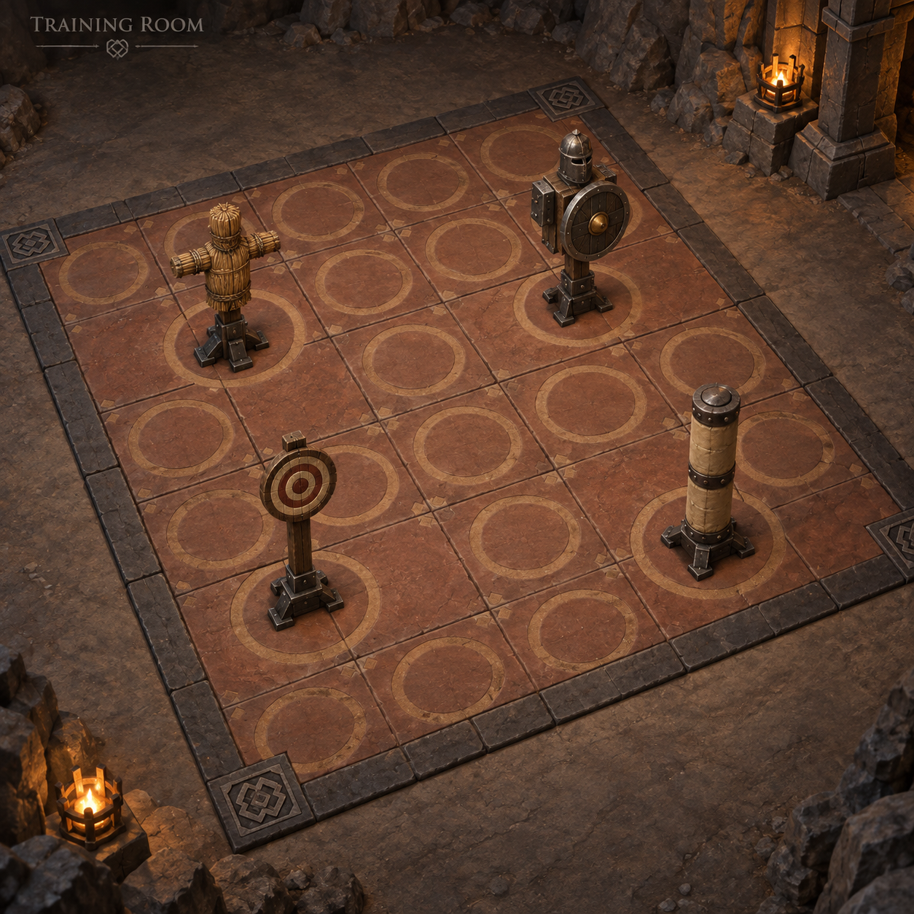
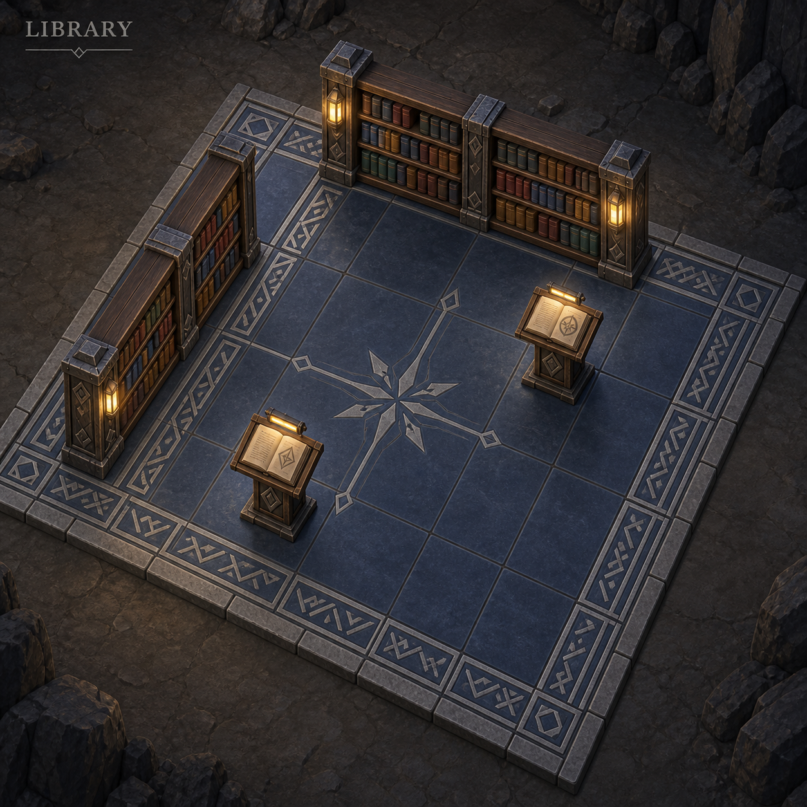

# Room overhaul concepts — 2026-09-09

Generated with the built-in imagegen tool. Six individual concept sheets, preceding implementation. The latest user brief takes precedence over illustrated walls, exact grids and incidental props. Furnishings adapt to real room geometry; no automatic dividing walls are added.

## treasure

Use case: stylized-concept. Asset type: individual room concept for Stonewake, a TypeScript/Babylon.js dwarven underground management game. Create a polished but achievable stylized 3D game concept, square image. Main view is a clear elevated isometric view of a SINGLE 5 by 5 square floor-tile room on the same flat ground as surrounding cavern, no raised plinth, no cutaway floating island. Weathered dwarven stone and restrained timber/metal, crisp readable shapes, modest warm practical light, neutral surrounding underground floor. The new priority is MUCH LESS VISUAL CLUTTER: at least 60 percent of the floor visibly empty, no tiny scattered props, no decorative junk, no people, no UI. Tile boundaries and room boundary are clear. Ground must be distinctive and visually dominant even when unfurnished. Include small unobtrusive room title only. TREASURE ROOM. Replace ALL chests and boxes with loose heaps of gold coins directly on individual floor squares. Show three consecutive squares filled with rounded piles to a consistent maximum height, then one smaller growing pile on the next square, remaining squares completely empty. Piles stay within their own tile, with readable broad mound silhouette and a few visible coin faces, not chaotic scattered coins. Floor: deep charcoal vault slabs with broad muted brass corner inlays and a simple inset diamond on each square. Gold shines against dark floor. No containers, furniture, racks or furniture lighting.

## dormitory

Use case: stylized-concept. Asset type: individual room concept for Stonewake, a TypeScript/Babylon.js dwarven underground management game. Create a polished but achievable stylized 3D game concept, square image. Main view is a clear elevated isometric view of a SINGLE 5 by 5 square floor-tile room on the same flat ground as surrounding cavern, no raised plinth, no cutaway floating island. Weathered dwarven stone and restrained timber/metal, crisp readable shapes, modest warm practical light, neutral surrounding underground floor. The new priority is MUCH LESS VISUAL CLUTTER: at least 60 percent of the floor visibly empty, no tiny scattered props, no decorative junk, no people, no UI. Tile boundaries and room boundary are clear. Ground must be distinctive and visually dominant even when unfurnished. Include small unobtrusive room title only. DORMITORY. Most of the 25 tiles remain empty; only FOUR occupied resident places receive bedding. Show one compact rust-red Warrior bed, one compact ochre Engineer cot, one blue Runesmith bed with restrained rune headboard, and one circular moss-green Cave Hound den cushion. Each bed fits entirely in ONE square, dwarven proportions, shallow frame, no towering head/footboards. These are assigned beds that remain even while residents are elsewhere, not twenty-five prebuilt beds. Floor: warm dark walnut-colored stone squares with a broad woven terracotta border and cream corner stitch motif. Empty marked squares communicate spare accommodation. No lockers, extra furniture, no unassigned empty beds.

## kitchen

Use case: stylized-concept. Asset type: individual room concept for Stonewake, a TypeScript/Babylon.js dwarven underground management game. Create a polished but achievable stylized 3D game concept, square image. Main view is a clear elevated isometric view of a SINGLE 5 by 5 square floor-tile room on the same flat ground as surrounding cavern, no raised plinth, no cutaway floating island. Weathered dwarven stone and restrained timber/metal, crisp readable shapes, modest warm practical light, neutral surrounding underground floor. The new priority is MUCH LESS VISUAL CLUTTER: at least 60 percent of the floor visibly empty, no tiny scattered props, no decorative junk, no people, no UI. Tile boundaries and room boundary are clear. Ground must be distinctive and visually dominant even when unfurnished. Include small unobtrusive room title only. KITCHEN. Simplify into ONE compact stone stove and cauldron at the rear and ONE long communal timber dining table with two simple benches, oriented together, no repeated cooking stations. Optionally one integrated end shelf on the stove, no barrels or mushroom farms or individual scattered tables. Clear routes and generous empty floor. Floor: warm muted terracotta tiles with cream alternating inset squares, broad cream perimeter band and understated hearth motif. Simple and welcoming.

## workshop

Use case: stylized-concept. Asset type: individual room concept for Stonewake, a TypeScript/Babylon.js dwarven underground management game. Create a polished but achievable stylized 3D game concept, square image. Main view is a clear elevated isometric view of a SINGLE 5 by 5 square floor-tile room on the same flat ground as surrounding cavern, no raised plinth, no cutaway floating island. Weathered dwarven stone and restrained timber/metal, crisp readable shapes, modest warm practical light, neutral surrounding underground floor. The new priority is MUCH LESS VISUAL CLUTTER: at least 60 percent of the floor visibly empty, no tiny scattered props, no decorative junk, no people, no UI. Tile boundaries and room boundary are clear. Ground must be distinctive and visually dominant even when unfurnished. Include small unobtrusive room title only. WORKSHOP. A single coherent work area: ONE substantial two-square central assembly bench, ONE separate anvil at the side, ONE narrow upright wall-like tool rack along rear edge (freestanding without requiring walls). No duplicates of the bench, anvil or rack as the room expands. Broad clear work apron, large empty open floor. Tools appear as a few simple silhouettes on rack, not scattered pieces. Floor: blue charcoal industrial flagstones with restrained wide brass guide stripes framing the work zone and a sparse geometric bolt motif; unmistakably different from treasury charcoal diamond tiles.

## training

Use case: stylized-concept. Asset type: individual room concept for Stonewake, a TypeScript/Babylon.js dwarven underground management game. Create a polished but achievable stylized 3D game concept, square image. Main view is a clear elevated isometric view of a SINGLE 5 by 5 square floor-tile room on the same flat ground as surrounding cavern, no raised plinth, no cutaway floating island. Weathered dwarven stone and restrained timber/metal, crisp readable shapes, modest warm practical light, neutral surrounding underground floor. The new priority is MUCH LESS VISUAL CLUTTER: at least 60 percent of the floor visibly empty, no tiny scattered props, no decorative junk, no people, no UI. Tile boundaries and room boundary are clear. Ground must be distinctive and visually dominant even when unfurnished. Include small unobtrusive room title only. TRAINING ROOM. All equipment is UPRIGHT and compact within one tile each: one straw humanoid striking dummy, one armored shield dummy, one upright round target on a post, one taller padded striking pillar. NO weight benches, barbells, horizontal exercise machinery or giant wooden platforms. Four well-spaced practice positions, lots of open maneuvering floor. Floor: warm iron-red sandstone with sand-colored outlined circular practice marks inset within squares and a clear dark border. Readable varied upright silhouettes.

## library

Use case: stylized-concept. Asset type: individual room concept for Stonewake, a TypeScript/Babylon.js dwarven underground management game. Create a polished but achievable stylized 3D game concept, square image. Main view is a clear elevated isometric view of a SINGLE 5 by 5 square floor-tile room on the same flat ground as surrounding cavern, no raised plinth, no cutaway floating island. Weathered dwarven stone and restrained timber/metal, crisp readable shapes, modest warm practical light, neutral surrounding underground floor. The new priority is MUCH LESS VISUAL CLUTTER: at least 60 percent of the floor visibly empty, no tiny scattered props, no decorative junk, no people, no UI. Tile boundaries and room boundary are clear. Ground must be distinctive and visually dominant even when unfurnished. Include small unobtrusive room title only. LIBRARY. Calm open archive: TWO long freestanding three-square bookcases, each a proper tall narrow shelf (no attached desks), aligned near rear and one side, plus TWO compact lecterns in open interior. Wide clear aisles, no small repeated individual tables, no clutter. Shelf volumes grouped into blocks of muted colored spines. Floor: cool midnight blue slate with pale silver angular rune borders and a subtle central star/compass motif. A couple of warm integrated reading lights only.
