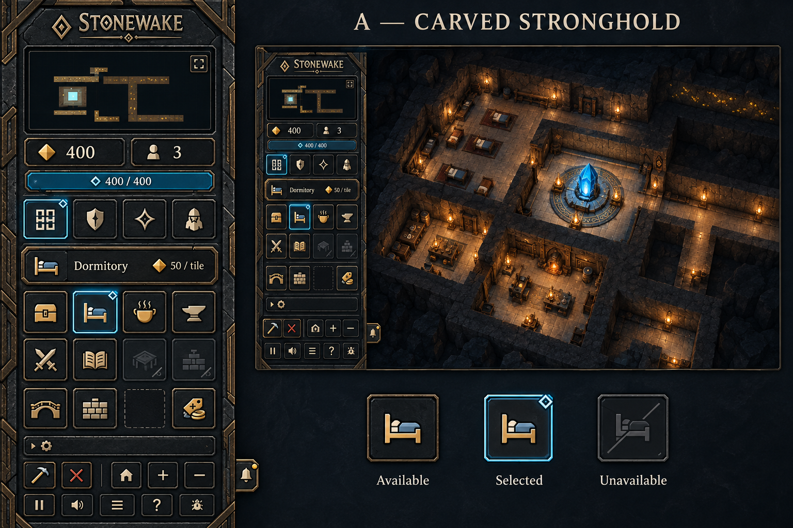
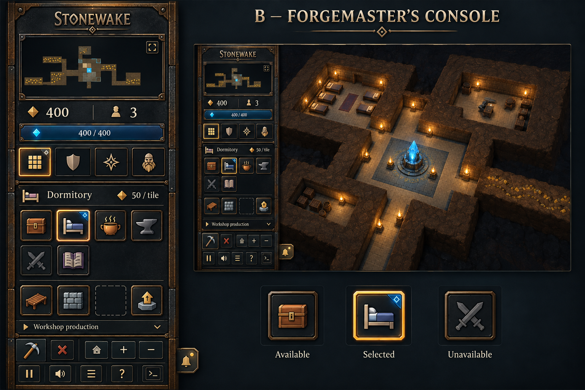
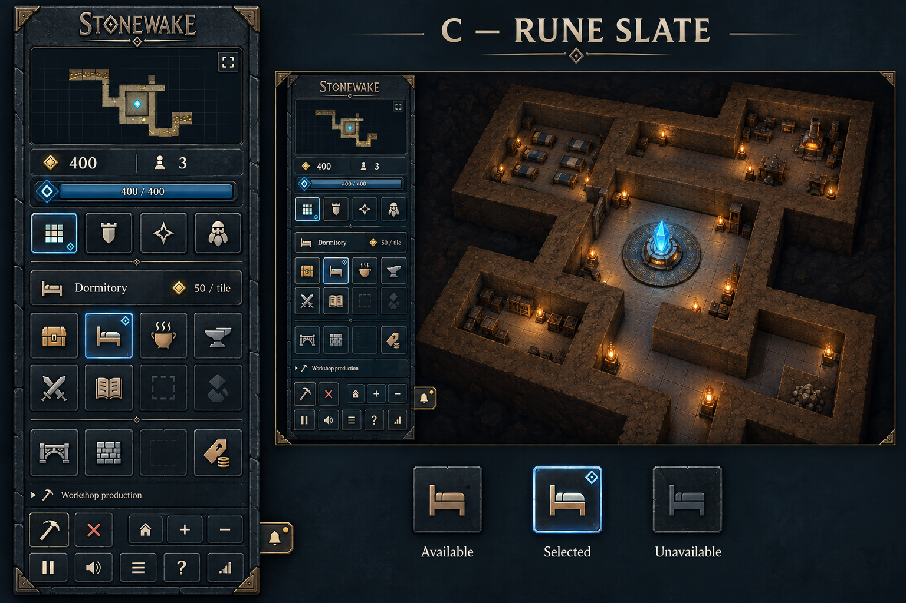

# Sidebar concepts

The user selected **A — Carved Stronghold**. The runtime uses [dedicated production skins](../../public/art/sidebar/README.md), chamfered sockets and redrawn SVG pictograms to match its carved stone/bronze appearance, with the user's further text-reduction direction. B and C remain comparison options. The boards were generated with the built-in image generation tool. [Exact prompts and reference roles](prompts-v1.md).

Each board contains an enlarged panel, an illustrated gameplay inset and button state studies. Generated values and incidental controls are illustrative, not new gameplay requirements. The current compact icon-based implementation and [text audit](../../gameplay-interface.md#sidebar-text-budget) take precedence over incidental concept labels and values.

## A — Carved Stronghold

Charcoal stone, angular bronze joints and blue selected outlines. The closest visual match to the approved menus.

## B — Forgemaster's Console

Blackened iron, riveted bronze rails and tactile colored icons. A warmer workshop character with amber selections.

## C — Rune Slate

Quiet slate surfaces, thin chiseled borders and restrained blue rune accents. The lightest visual treatment of the three.

