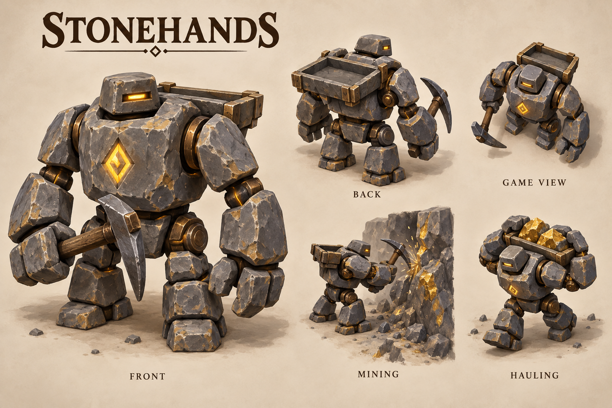

# Stonehands

[Return to concept art](../README.md).

First visual proposal for small expendable rune-powered labor constructs, replacing the thematic role of dwarf Miners. They work continuously without food or accommodation. Gameplay replacement is not implemented by this concept-art change.

Slate stone bodies, amber rune cores, oversized hands and a bronze-framed cargo tray make the worker readable from above. The five views explore one consistent design. [Exact generation prompt](prompts.md).
