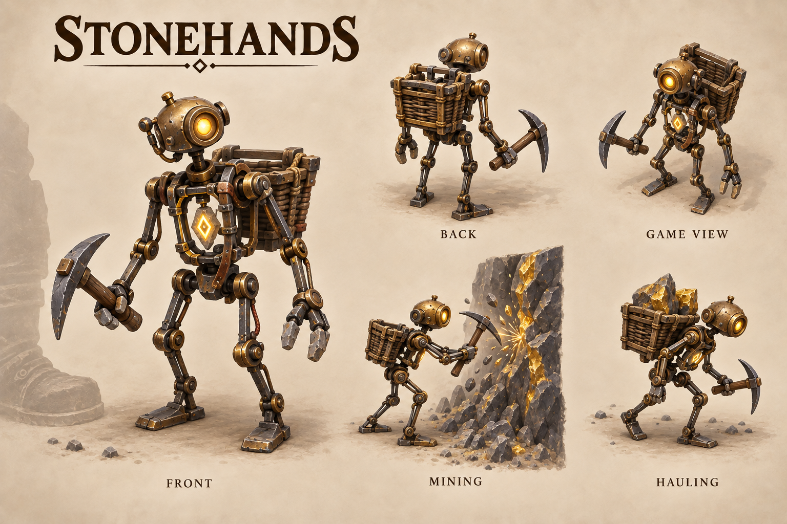

# Stonehands

[Return to concept art](../README.md).

Approved visual direction for small expendable rune-powered labor constructs, replacing the thematic role of dwarf Miners. They work continuously without food or accommodation. Stonehands now replace the normal starting and purchased labor crew. The original Miner definition/model remains for later reuse.

The current revision follows the user's request for a smaller, more mechanical and visibly fragile worker. Thin exposed bronze/iron linkages surround a small amber rune tablet; little footplates and a lightweight basket replace the original armored stone mass. The five views explore one consistent design. [Revision prompt](prompts-v2.md).

The [original bulky stone design](stonehands-v1.png) is retained for comparison, with its [original prompt](prompts.md).
