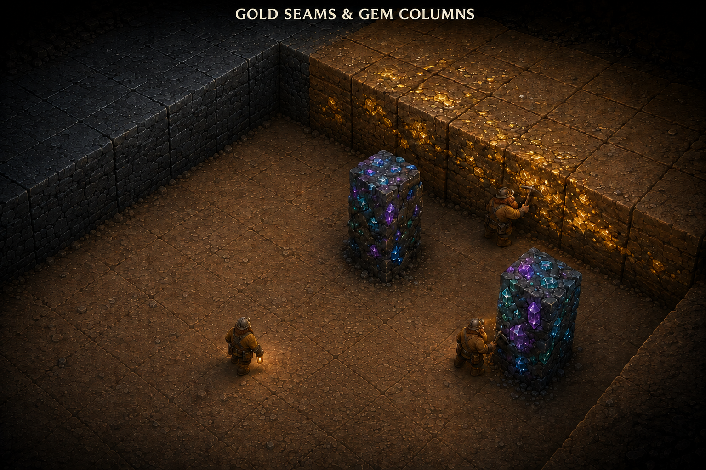

# Terrain and resource concept art

Environment concepts for the dwarf stronghold game. Return to [all concept art](../README.md). Related design: [Levels](../../levels.md), [Game rules](../../game-rules.md), and the [terrain grid comparison](../rooms/terrain-grid-v3.png).

## Gold seams and gem columns

[Open the full concept](resource-terrain-v2.png).

This concept shows one larger connected mine area, using large square excavation cells and a single terrain layer. Intact terrain has a common top height, and excavated space has one walkable floor plane. Exposed wall sections, ground, and resource footprints share the construction grid. Small miners provide scale and move within the open space.

- **Dirt:** ordinary diggable ground within full-height banks. The lower selected shelf and low isolated earth block from the first image have been removed to open floor. Retained earth cells remain allowed in the game when they occupy the full terrain height.
- **Gold seams:** metallic veins within adjacent earth or rock cells, visible on their tops and exposed vertical faces. Mining exhausts these cells and opens space.
- **Gem columns:** persistent mineral-rich columns with square terrain footprints and accessible working faces. They represent the existing renewable gem deposits and yield the same gold currency.
- **Bedrock:** a continuous band of dense rock connected to the wider geology, with boundaries following grid edges.

The user approved this image as a representation of the overall terrain appearance, as well as the gem-column design and gold seam's top-and-side treatment. It is the primary visual reference for the [level and region concepts](../levels/README.md). Gold and gems should stay identifiable without relying on selection highlights. The subsequent gameplay decision makes gold and gem deposits visible through unexplored terrain on both planning maps; the main world view still follows normal discovery. Exact tile dimensions, miner-to-cell scale, and selection styling remain visual and implementation details to refine.

## References and provenance

Created using the built-in image generation tool. The [revision prompt](prompts-v2.md) records the user's terrain-height corrections and the approved features to preserve. The [original prompt](prompts.md) records the first composition and source roles.

The user supplied a [Dungeon Keeper excavation screenshot](references/dungeon-keeper-excavation-reference.png) to demonstrate the large action cells and top/side readability. It is retained as reference material, separate from the original game concept above. The earlier `terrain-grid-v2.png` study (available in Git history at `26bf924:concept-art/rooms/terrain-grid-v2.png`) and [Miner concept](../dwarfs/miner-v1.png) supplied project continuity. The [current terrain study](../rooms/terrain-grid-v3.png) is a later revision.

The superseded terrain image and intermediate draft have been removed. Their prompt records preserve the corrections that produced the current single-layer concept.
