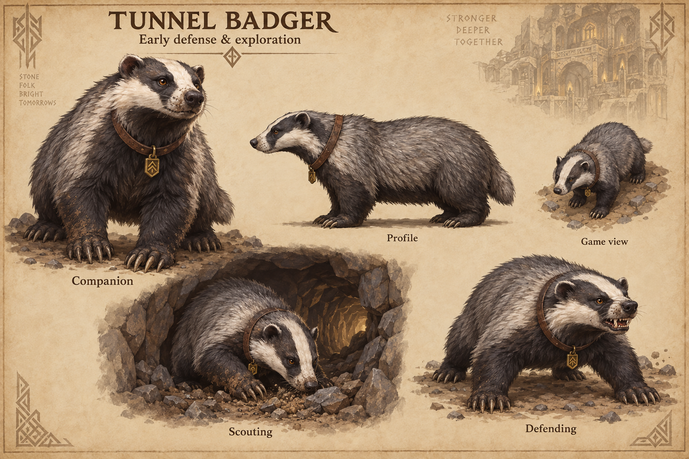

# Tunnel badgers

[Return to concept art](../README.md).

Visual exploration of a dwarven animal companion for early defense and exploration. A low, sturdy body, striped face, powerful digging paws and a simple rune-tag collar distinguish the badger from the [cave hound](../cave-hounds/README.md). Five views explore companion, profile, game silhouette, scouting and defending poses.

This is a visual proposal, not implemented gameplay or settled recruitment requirements. [Generation prompt](prompts-v1.md).
